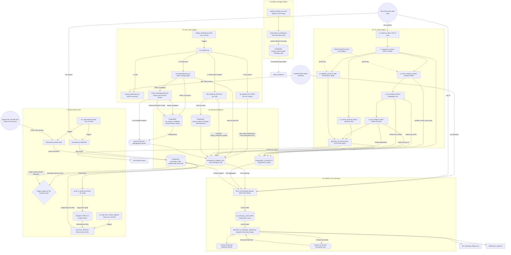

Last Updated: 2026-03-22 15:58 EST

```mermaid
flowchart TB
 subgraph backend[01_KOL_Data_Engine]
        nightly_scheduler_py[nightly_scheduler.py Daily Cron 2:00 AM]
        run_pipeline_py[run_pipeline.py]
        extract_publications_py[extract_publications.py ORCID extraction]
        db_ingestion_py[db_ingestion.py ORCID-first KOL lookup]
        kol_disambiguator_py[kol_disambiguator.py 4-signal scoring engine]
        kol_weight_py[kol_weight.py APW log 1 sum SJR]
        review_disambiguations_py[review_disambiguations.py Human Gemini Flash Review]
  end
 subgraph ct_engine[02_CT_Data_Engine]
        ct_crawler_py[ct_crawler.py Step 2 API v2 crawl]
        ct_ingestion_py[ct_ingestion.py Step 3 JSON 11 tables]
        ct_mesh_mapper_py[ct_mesh_mapper.py Step 4 condition MeSH]
        ct_kol_bridge_py[ct_kol_bridge.py Step 5 investigator KOL]
        ct_results_parser_py[ct_results_parser.py Step 6 outcomes AEs]
        ct_pub_bridge_py[ct_pub_bridge.py Step 7 PMID KOL pubs]
        ct_eligibility_parser_py[ct_eligibility_parser.py Step 8 biomarkers stage]
        generate_kol_brief_py[generate_kol_brief.py Step 9 KOL Brief output]
        GeminiFlash{{Gemini Flash API Cloud LLM Fallback}}
  end
 subgraph ta_landscape[05_Product_TA_Landscape]
        fetch_ta_landscape_data_py[fetch_ta_landscape_data.py Batch API Fetcher]
        generate_ta_landscape_stepwise_py[generate_ta_landscape_stepwise.py Stepwise Generation Engine]
        ta_landscape_cache[(ta_landscape_cache JSON PostgreSQL Cache)]
        HIL_Prompt{{Human-in-the-loop Stepwise Review}}
        GeminiPro{{Gemini 2.5 Pro API Consulting Voice}}
  end
 subgraph biocrawler[03_BioCrawler_GTM]
        run_biocrawler_bat[run_biocrawler.bat Daily Cron 5:00 PM]
        biocrawler_py_api[biocrawler.py Mode API]
        biocrawler_py_deep[biocrawler.py Mode Deep]
        bridge_engine_py{bridge_engine.py The Synapse Layer}
        run_pull_from_sheets_daily_bat[run_pull_from_sheets_daily.bat Daily Cron 4:00 PM]
        push_to_sheets_py[push_to_sheets.py Extract 20 Leads]
        pull_from_sheets_py[pull_from_sheets.py Reverse Sync URLs]
        Meddash_CRM_V1[(Meddash CRM V1.0 Google Sheets)]
  end
 subgraph mdm_ontology[08_MDM_Ontology_Engine]
        build_disease_ontology_py[build_disease_ontology.py Pulls NIH UMLS APIs]
        weekly_ontology_sync_bat[weekly_ontology_sync.bat Weekly Cron Sunday]
        disease_criteria_db[(PostgreSQL disease_criteria MDM Ontology Layer)]
  end
 subgraph datastores[06_Shared_Datastores]
        meddash_kols_db[(PostgreSQL meddash_kols Core Intelligence DB)]
        ct_trials_db[(PostgreSQL ct_trials.db CT Engine DB 11 tables)]
        biocrawler_leads_db[(PostgreSQL biocrawler_leads Relationship Graph DB)]
        kol_merge_candidates_db[(PostgreSQL kol_merge_candidates Human Review Queue)]
        journal_metrics_db[(PostgreSQL journal_metrics SCImago SJR Reference)]
  end

    nightly_scheduler_py -- Triggers --> run_pipeline_py
    run_pipeline_py -- 1. Calls --> extract_publications_py
    run_pipeline_py -- 2. SQL Upsert --> db_ingestion_py
    run_pipeline_py -- 3. Scores pairs --> kol_disambiguator_py
    run_pipeline_py -- 4. Recomputes weights --> kol_weight_py
    kol_disambiguator_py -- Writes candidates --> review_disambiguations_py
    ct_crawler_py --> ct_ingestion_py
    ct_ingestion_py --> ct_mesh_mapper_py & ct_results_parser_py & ct_eligibility_parser_py & ct_trials_db
    ct_mesh_mapper_py --> ct_kol_bridge_py
    ct_kol_bridge_py --> ct_pub_bridge_py
    ct_results_parser_py --> generate_kol_brief_py
    ct_pub_bridge_py --> generate_kol_brief_py
    ct_eligibility_parser_py --> generate_kol_brief_py
    GeminiFlash -. gemini flag .-> ct_mesh_mapper_py & ct_eligibility_parser_py
    run_biocrawler_bat -- Triggers --> biocrawler_py_api & biocrawler_py_deep
    Internet1((PubMed NCBI Global Literature)) -- XML JSON ORCID --> extract_publications_py
    db_ingestion_py -- SQL Upsert publications kols authorships orcid --> meddash_kols_db
    kol_disambiguator_py -- Bulk pre-load sets --> meddash_kols_db
    kol_disambiguator_py -- Write scored pairs --> kol_merge_candidates_db
    kol_weight_py -- JOIN via ISSN --> journal_metrics_db
    kol_weight_py -- UPDATE author_publication_weight --> meddash_kols_db
    review_disambiguations_py -- Reads candidates --> kol_merge_candidates_db
    review_disambiguations_py -- Per-candidate analysis --> LLM{{Gemini Flash API Bibliographic Advisor}}
    review_disambiguations_py -- APPROVE REJECT SKIP --> kol_merge_candidates_db
    Internet2((ClinicalTrials.gov 480k Trials)) -- API v2 REST --> ct_crawler_py
    ct_mesh_mapper_py -- condition_mesh_map cache --> ct_trials_db
    ct_kol_bridge_py -- Reads KOLs MeSH --> meddash_kols_db
    ct_kol_bridge_py -- Writes kol_id FKs --> ct_trials_db
    ct_pub_bridge_py -- Reads publications --> meddash_kols_db
    ct_pub_bridge_py -- Writes kol_pub_id --> ct_trials_db
    generate_kol_brief_py -- Reads CT KOL data --> ct_trials_db
    generate_kol_brief_py -- Reads pub signal --> meddash_kols_db
    generate_kol_brief_py --> KOLBrief[s26 Output Product]
    Internet1 -- xml_abstracts --> fetch_ta_landscape_data_py
    Internet2 -- api_v2 --> fetch_ta_landscape_data_py
    meddash_kols_db -- KOL Rankings --> fetch_ta_landscape_data_py
    ct_trials_db -- Trial Aggregates --> fetch_ta_landscape_data_py
    biocrawler_leads_db -- Catalyst Signals --> fetch_ta_landscape_data_py
    fetch_ta_landscape_data_py -- Cache JSON --> ta_landscape_cache
    ta_landscape_cache -- Load Context --> generate_ta_landscape_stepwise_py
    generate_ta_landscape_stepwise_py <--> HIL_Prompt
    generate_ta_landscape_stepwise_py -- Prompt Instructions --> GeminiPro
    GeminiPro -- Generated Narrative --> generate_ta_landscape_stepwise_py
    generate_ta_landscape_stepwise_py --> Report[TA_Landscape_Report.md] & Audit[References_Audit.md]
    Internet2 -- API Search --> biocrawler_py_api
    Internet3((Clearbit SEC EDGAR ATS Deep Crawl Sources)) -- HTML JSON Scrape --> biocrawler_py_deep
    biocrawler_py_api -- SQL Upsert --> biocrawler_leads_db
    biocrawler_py_deep -- Deep Enrichment --> biocrawler_leads_db
    meddash_kols_db -- Calculates Real-time SVS --> bridge_engine_py
    biocrawler_leads_db -- Maps Advisory Board Networks --> bridge_engine_py
    biocrawler_leads_db -- Daily Extract --> push_to_sheets_py
    push_to_sheets_py -- Append 20 Leads --> Meddash_CRM_V1
    run_pull_from_sheets_daily_bat -- Triggers --> pull_from_sheets_py
    Meddash_CRM_V1 -- Read Manual URLs --> pull_from_sheets_py
    pull_from_sheets_py -- Update DB with URLs --> biocrawler_leads_db
    journal_metrics_db --> meddash_kols_db
    kol_merge_candidates_db -- Deduplication --> LLM
    LLM --> meddash_kols_db

    weekly_ontology_sync_bat --> build_disease_ontology_py
    build_disease_ontology_py -. Upserts Medical Concepts .-> disease_criteria_db
    disease_criteria_db -. Crosswalk Autocomplete .-> UI[Next.js Global UI]
```
