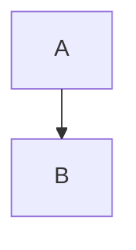

# Mermaid.ai Feature Mapping - FINAL

## Findings:
- **Hierarchical Layout**: Confirmed as the **ELK (Eclipse Layout Kernel)** engine. It's superior for large hierarchical diagrams as it minimizes arrow crossings.
- **Auto vs. Manual Layout**:
  - **Auto**: Uses engines like `elk` or `dagre`.
  - **Manual**: Proprietary "Visual Editor" for dragging nodes. (Not needed for simple replica).
- **Arrows**: The "un-jumbling" is a property of the ELK layout engine.
- **Light/Dark Mode**: Toggle in the UI (usually top right or settings).
- **App Structure**:
  - **Left Pane**: Text/Code Editor (Mermaid syntax).
  - **Right Pane**: Rendered Canvas (rendered with Mermaid.js + ELK).
  - **Toolbar**: Contains Layout Engine Selector (Dagre/ELK) and Theme Toggle.

## Local Replica Implementation Plan:
1. **Core Library**: Use `mermaid.js` with the `@mermaid-js/layout-elk` plugin.
2. **Editor**: Use `Monaco Editor` or `CodeMirror` for the Mermaid code input.
3. **Canvas**: A simple `div` where Mermaid renders the SVG.
4. **Controls**:
   - Radio buttons/Dropdown for "Layout Engine" (Default/ELK).
   - Switch for "Theme" (Light/Dark).
5. **Logic**: On code change, call `mermaid.render()` with the selected layout engine.

## Layout Configuration Example:
```javascript
mermaid.initialize({
  layout: 'elk',
  theme: 'dark' // or 'default'
});
```
Or via directive:

