# Meddash Phase 3 Workflow — Optimized per MDP3-SWIP1

> **Created:** 2026-04-26 12:36 EST  
> **Based on:** MDP3-SWIP1 (Step-Wise Implementation Plan: Pre-Automation Fixes)  
> **Derived from:** ver 2.0_organized_meddashbackend_schema.txt (Phase 2 — unchanged)  
> **Status:** SWIP1 complete. All engines n8n-ready. Pre-SWIP2.

---

## SWIP1 Changes Applied to Phase 3

| Section | What Changed | Impact |
|---------|-------------|--------|
| SWIP1-A | Engine 01 — Removed hardcoded NSCLC fallback; added MeSH rotation (T1+T2 merge) | nightly_scheduler.py is now one-shot with rotation logic |
| SWIP1-B | Engine 02 — ct_crawler: JSON summary, exit codes, paths.py | n8n can detect success/failure/partial |
| SWIP1-C | Engine 03 — biocrawler: JSON summary, argparse CLI, exit codes, no .bat | n8n calls biocrawler.py directly |
| SWIP1-D | Removed schedule.py — nightly_scheduler is single-run | n8n handles 2AM trigger |
| SWIP1-E | Telegram notifier v2.0 — dual-bot (CQ + Meddash), rate-limited | Structured alerts per engine |
| SWIP1-F | mesh_rotation.py — 12-category ISO week rotation with dedup | T1 BioCrawler leads + T2 MeSH rotation = full coverage |
| SWIP1-G | pipeline_summary.py — standard JSON output for all engines | n8n can parse summaries in SWIP2 |
| SWIP1-H | paths.py — central path config, WSL + Windows dual support | No more hardcoded C:\Users\email paths |
| SWIP1-I | mesh_rotation_log.db — SQLite rotation metrics + growth tracking | Audit trail and projection reports |
| SWIP1-J | End-to-end dry-run validation — all 8 checks passed | Ready for SWIP2 automation |

---

## Phase 3 Mermaid Workflow Diagram

```mermaid
---
config:
  layout: elk
---
flowchart TB
  subgraph frontend[Meddash Local SaaS UI - Next.js 15]
    ui_dashboard[Dashboard UI Page]
    ui_pipeline[Crawler Control & Execution UI]
    ui_sandbox[Campaign Sandbox Validation UI]
    ui_scholar[Scholar Enrichment UI - Final KOLs Manual Lane]
    ui_health[System Health & Log Streaming UI]
  end

  subgraph api[FastAPI Middleware & Subprocess Manager]
    api_server[api_server.py REST Bridge]
  end

  subgraph orchestrator[n8n Orchestrator - Phase 3 Scheduling]
    n8n_kol_trigger[n8n Cron 02:00 AM<br/>KOL Pipeline Trigger]
    n8n_ct_trigger[n8n Cron 06:00 AM<br/>CT Crawler Trigger]
    n8n_bio_trigger[n8n Cron 05:00 PM<br/>BioCrawler Trigger]
    n8n_monitor[n8n Monitor Node<br/>Health Check & Alerts]
  end

  subgraph backend[01_KOL_Data_Engine v2.0 n8n-Ready]
    nightly_scheduler_py[nightly_scheduler.py v2.0<br/>One-Shot Runner - No Schedule Lib]
    mesh_rotation_py[mesh_rotation.py<br/>12-Category ISO Week Rotation]
    run_pipeline_py[run_pipeline.py<br/>Command Controller]
    extract_publications_py[extract_publications.py<br/>ORCID XML Extractor]
    db_ingestion_py[db_ingestion.py<br/>Pull ID Staging Injection]
    kol_disambig_tier1[kol_disambiguator.py<br/>Tier 1 Auto-Engine]
    kol_weight_py[kol_weight.py<br/>APW log1sum SJR]
  end

  subgraph scholar_engine[09_Scholar_Engine]
    sync_scholar_citations_py[sync_scholar_citations.py<br/>Manual Scholar URL Sync + Final ID Repair]
  end

  subgraph ct_engine[02_CT_Data_Engine v2.0 n8n-Ready]
    ct_crawler_py[ct_crawler.py v2.0<br/>Step 2 API v2 crawl<br/>+ JSON Summary + Exit Codes]
    ct_ingestion_py[ct_ingestion.py<br/>Step 3 JSON 11 tables]
    ct_mesh_mapper_py[ct_mesh_mapper.py Step 4 condition MeSH]
    ct_kol_bridge_py[ct_kol_bridge.py Step 5 investigator KOL]
    ct_results_parser_py[ct_results_parser.py Step 6 outcomes AEs]
    ct_pub_bridge_py[ct_pub_bridge.py Step 7 PMID KOL pubs]
    ct_eligibility_parser_py[ct_eligibility_parser.py Step 8 biomarkers stage]
    generate_kol_brief_py[generate_kol_brief.py Step 9 KOL Brief output]
    GeminiFlash{{Gemini Flash API<br/>Cloud LLM Fallback}}
  end

  subgraph biocrawler[03_BioCrawler_GTM v2.0 n8n-Ready]
    biocrawler_py_api[biocrawler.py Mode API<br/>+ JSON Summary + Exit Codes]
    biocrawler_py_deep[biocrawler.py Mode Deep<br/>+ JSON Summary + Exit Codes]
    bridge_engine_py{bridge_engine.py<br/>The Synapse Layer}
    push_to_sheets_py[push_to_sheets.py<br/>Extract 20 Leads]
    pull_from_sheets_py[pull_from_sheets.py<br/>Reverse Sync URLs]
    Meddash_CRM_V1[(Meddash CRM V1.0<br/>Google Sheets)]
  end

  subgraph ta_landscape[05_Product_TA_Landscape]
    fetch_ta_landscape_data_py[fetch_ta_landscape_data.py Batch Fetcher]
    generate_ta_landscape_stepwise_py[generate_ta_landscape_stepwise.py Engine]
    ta_landscape_cache[(ta_landscape_cache JSON)]
    HIL_Prompt{{Human-in-the-loop Review}}
    GeminiPro{{Gemini 2.5 Pro API Consulting}}
  end

  subgraph mdm_ontology[08_MDM_Ontology_Engine]
    build_disease_ontology_py[build_disease_ontology.py Pulls UMLS APIs]
    weekly_ontology_sync_bat[weekly_ontology_sync.bat Weekly Cron]
    disease_criteria_db[(PostgreSQL disease_criteria MDM Layer)]
  end

  subgraph devops[07_DevOps_Observability - Phase 3 New]
    paths_py[paths.py<br/>Central Path Config<br/>WSL + Windows Dual Support]
    pipeline_summary_py[pipeline_summary.py<br/>Standard JSON Summary Writer]
    telegram_notifier_py[telegram_notifier.py v2.0<br/>Dual-Bot: CQ + Meddash<br/>Rate Limited 2s / channel]
    mesh_rotation_state_json[(mesh_rotation_state.json<br/>Rotation State Tracker)]
    mesh_rotation_log_db[(mesh_rotation_log.db<br/>SQLite Rotation Metrics)]
    summary_dir[(pipeline_summaries/<br/>Standard JSON Output Dir)]
  end

  subgraph datastores[06_Shared_Datastores - PostgreSQL Cluster]
    kols_staging_db[(kols_staging<br/>Pull ID Sandbox)]
    kol_merge_candidates_db[(kol_merge_candidates<br/>Tier 2 Queue)]
    deep_disambiguation_db[(deep_disambiguation_needed<br/>Tier 3 Escalation)]
    meddash_kols_db[(meddash_kols<br/>Global Intelligence Target)]
    kol_scholar_metrics_db[(kol_scholar_metrics<br/>Scholar Metrics)]
    ct_trials_db[(ct_trials CT Engine DB)]
    biocrawler_leads_db[(biocrawler_leads<br/>Relationship DB)]
    journal_metrics_db[(journal_metrics<br/>SCImago SJR)]
  end

  %% ==================== n8n ORCHESTRATION ====================
  n8n_kol_trigger -- "HTTP / CLI trigger" --> nightly_scheduler_py
  n8n_ct_trigger -- "HTTP / CLI trigger" --> ct_crawler_py
  n8n_bio_trigger -- "HTTP / CLI trigger" --> biocrawler_py_api
  n8n_monitor -- "Read summaries" --> summary_dir
  n8n_monitor -- "Alert dispatch" --> telegram_notifier_py

  %% ==================== UI TO API ====================
  ui_pipeline -- "POST Configuration" --> api_server
  ui_health -- "GET /api/system/logs" --> api_server
  ui_sandbox -- "GET staged kols / Resolve pairs" --> api_server
  ui_sandbox -- "Step 3: Manual Scholar URLs" --> api_server
  ui_scholar -- "Load final kols by pull_id" --> api_server

  %% ==================== API TO BACKEND ====================
  api_server -- "Subprocess threads" --> run_pipeline_py & ct_crawler_py & biocrawler_py_api
  api_server -- "Read / Write" --> kols_staging_db & kol_merge_candidates_db & deep_disambiguation_db
  api_server -- "Manual Scholar Sync" --> sync_scholar_citations_py
  api_server -- "Repair final kols.id" --> meddash_kols_db

  %% ==================== MeSH ROTATION T1+T2 MERGE ====================
  biocrawler_leads_db -- "T1: BioCrawler lead targets" --> mesh_rotation_py
  mesh_rotation_py -- "T1 + T2 merged targets (deduped)" --> nightly_scheduler_py
  mesh_rotation_py -- "Update state" --> mesh_rotation_state_json
  mesh_rotation_py -- "Log metrics" --> mesh_rotation_log_db

  %% ==================== KOL PIPELINE CORE ====================
  nightly_scheduler_py -- "Triggers with merged targets" --> run_pipeline_py
  run_pipeline_py -- "1. Target Query" --> extract_publications_py
  run_pipeline_py -- "2. SQL JSON Dump" --> db_ingestion_py
  run_pipeline_py -- "3. Runs Disambiguator" --> kol_disambig_tier1
  run_pipeline_py -- "4. Calc SVS Weights" --> kol_weight_py
  run_pipeline_py -- "Writes kol_pipeline_summary.json" --> summary_dir

  Internet1((PubMed NCBI API)) -- "XML JSON" --> extract_publications_py
  db_ingestion_py -- "CSV Pull ID Arrays" --> kols_staging_db

  %% ==================== MULTI-TIER DISAMBIGUATION ====================
  kols_staging_db -- "Raw Pairs" --> kol_disambig_tier1
  kol_disambig_tier1 -- "Tier 1: ORCID/Score >= 0.70" --> kols_staging_db
  kol_disambig_tier1 -- "Tier 1: Uncertain Pairs < 0.70" --> kol_merge_candidates_db
  kol_merge_candidates_db -- "Pending Pairs" --> ui_sandbox
  ui_sandbox <--> GeminiFlash25{{Gemini Flash 2.5<br/>HITL Context Review}}
  ui_sandbox -- "Tier 2: Same/Distinct" --> kols_staging_db
  ui_sandbox -- "Tier 2: Escalate" --> deep_disambiguation_db
  ui_sandbox -- "Sandbox Approved Commit" --> meddash_kols_db

  %% ==================== SCHOLAR ENRICHMENT ====================
  sync_scholar_citations_py -- "Validate Scholar URL" --> ui_sandbox
  sync_scholar_citations_py -- "Validate Scholar URL" --> ui_scholar
  sync_scholar_citations_py -- "Update scholar_status & profile_url" --> kols_staging_db
  sync_scholar_citations_py -- "Update scholar_status & profile_url" --> meddash_kols_db
  sync_scholar_citations_py -- "Upsert metrics" --> kol_scholar_metrics_db

  kol_weight_py -- "UPDATE APW" --> meddash_kols_db
  journal_metrics_db -- "JOIN via ISSN" --> kol_weight_py

  %% ==================== DEVOPS PATH RESOLUTION ====================
  paths_py -. "MEDDASH_ROOT + DB_PATHS + ENGINE_PATHS" .-> nightly_scheduler_py & ct_crawler_py & biocrawler_py_api & ct_ingestion_py
  telegram_notifier_py -. "CQ + Meddash dual-bot alerts" .-> n8n_monitor

  %% ==================== NIGHTLY SCHEDULER FLAGS ====================
  nightly_scheduler_py -- "--dry-run" --> N_DryRun[Dry Run Output<br/>Targets + Rotation Preview]
  nightly_scheduler_py -- "--targets-override" --> N_Override[Custom Target List<br/>Bypass BioCrawler + Rotation]
  nightly_scheduler_py -- "Telegram: KOL summary" --> telegram_notifier_py

  %% ==================== CLINICAL TRIALS ENGINE ====================
  Internet2((ClinicalTrials.gov v2 APIs)) --> ct_crawler_py
  ct_crawler_py --> ct_ingestion_py
  ct_crawler_py -- "Writes ct_crawler_summary.json" --> summary_dir
  ct_ingestion_py --> ct_trials_db
  ct_trials_db --> ct_mesh_mapper_py & ct_results_parser_py & ct_eligibility_parser_py
  ct_mesh_mapper_py --> ct_kol_bridge_py
  ct_kol_bridge_py -- "Reads KOLs" --> meddash_kols_db
  ct_kol_bridge_py --> ct_pub_bridge_py
  ct_pub_bridge_py -- "Reads Pubs" --> meddash_kols_db
  ct_results_parser_py --> generate_kol_brief_py
  generate_kol_brief_py --> KOLBrief[Output Product]
  GeminiFlash -. "Parsing Fallback" .-> ct_mesh_mapper_py & ct_eligibility_parser_py

  %% ==================== BIOCRAWLER GTM ====================
  Internet2 --> biocrawler_py_api
  Internet3((Clearbit SEC EDGAR Deep Scan)) --> biocrawler_py_deep
  biocrawler_py_api & biocrawler_py_deep -- "Upserts" --> biocrawler_leads_db
  biocrawler_py_api & biocrawler_py_deep -- "Writes biocrawler_summary.json" --> summary_dir
  biocrawler_leads_db <--> bridge_engine_py
  meddash_kols_db --> bridge_engine_py
  push_to_sheets_py <-- "Daily Extract" --> biocrawler_leads_db
  pull_from_sheets_py <-- "Weekly Update" --> biocrawler_leads_db
  push_to_sheets_py --> Meddash_CRM_V1
  Meddash_CRM_V1 --> pull_from_sheets_py
  biocrawler_py_api & biocrawler_py_deep -- "Telegram: BioCrawler summary" --> telegram_notifier_py
  ct_crawler_py -- "Telegram: CT summary" --> telegram_notifier_py

  %% ==================== TA LANDSCAPE ====================
  fetch_ta_landscape_data_py -- "Cached Extracts" --> ta_landscape_cache
  meddash_kols_db & ct_trials_db & biocrawler_leads_db --> fetch_ta_landscape_data_py
  ta_landscape_cache --> generate_ta_landscape_stepwise_py
  generate_ta_landscape_stepwise_py <--> HIL_Prompt
  generate_ta_landscape_stepwise_py <--> GeminiPro
  generate_ta_landscape_stepwise_py --> TA_Landscape_Report[Markdown Product]

  %% ==================== ONTOLOGY ENGINE ====================
  weekly_ontology_sync_bat --> build_disease_ontology_py
  build_disease_ontology_py -. "Upserts Medical Concepts" .-> disease_criteria_db
  disease_criteria_db -. "Autocomplete & Standardization" .-> frontend
```

---

## Key Differences from Phase 2

1. **n8n Orchestrator subgraph** — Replaces `<schedule>` library and `.bat` file triggers. n8n fires all three engines on cron.
2. **mesh_rotation.py** — T1 (BioCrawler leads) + T2 (ISO week MeSH rotation) merge with dedup. No more hardcoded NSCLC fallback.
3. **07_DevOps_Observability subgraph** — New in Phase 3. Contains `paths.py`, `pipeline_summary.py`, `telegram_notifier.py v2.0`, rotation state/log, and summary output directory.
4. **All engines n8n-ready** — Structured exit codes (0/1/2), JSON summary output, path resolution via `paths.py`. No `.bat` wrappers.
5. **Dual-bot Telegram** — CQ channel + Meddash channel, rate-limited to 2s/channel.
6. **nightly_scheduler v2.0** — Single-run (no `while True`), `--dry-run`, `--targets-override`, `--skip-rotation`, `--pull-id`.
7. **Summary JSON convention** — Every engine writes `{engine}_summary.json` to `pipeline_summaries/`. n8n will parse these in SWIP2.
8. **mesh_rotation_log.db** — SQLite audit trail of every rotation run: category, publications found, KOLs disambiguated/weighted, cycle tracking.

---

*End of Phase 3 Workflow Diagram. Next: SWIP2 — n8n + Paperclip + Alfred Triarchy Automation.*