# MDP3 Current Architecture — Meddash + Clinical Quant

Generated: 2026-04-29 02:15 EDT
File: `mdp3.architecture.20260429-0215.md`
Scope: current live architecture after ticker-spine reversal, n8n simplification, Paperclip trigger corrections, Supabase market tables, CQ runner coupling, Ops API consolidation, C-run verification fixes, bounded scheduled KOL lane, SEC timeout bounding, Streamlit dashboard auto-refresh repair, and centralized Telegram authority.

This is the operational architecture snapshot for Meddash Phase 3. It maps the actual working system as of this timestamp, including n8n, local Ops API, Meddash engines, CQ engines, Supabase, local SQLite stores, Paperclip agents, Telegram, Hermes/Alfred, Obsidian vaults, and Agent Zero CQ reference pillar.

Secrets are intentionally omitted. Credential values, API keys, bot tokens, service-role keys, connection strings, and Paperclip bearer tokens are represented only as `[REDACTED]` or by non-secret endpoint/path names.

---

## 0. Executive Summary

The Meddash/CQ system is now a four-pillar operating system:

1. **n8n = Hands**
   - Schedules deterministic workflows.
   - Calls local HTTP endpoints only.
   - No Code-node `require()` execution.
   - No Execute Command dependency.
   - No Telegram Trigger webhooks.

2. **Local Python Ops API = Execution Router**
   - Runs local scripts from WSL.
   - Owns subprocess execution, timeouts, Telegram sends, and health checks.
   - Lives at `http://127.0.0.1:8765`.

3. **Paperclip = Worker/Agent Factory**
   - Receives assigned issues from n8n.
   - Agents perform bounded reasoning, review, selection, QA, and monitoring.
   - Critical fixed rule: n8n must use `assigneeAgentId` with full UUID and explicitly wake agents.

4. **Alfred/Hermes + Obsidian = Overseer + Brain**
   - Alfred fixes, documents, and orchestrates.
   - Obsidian/Hermes vault is durable memory and operational index.
   - SWIP4 remains the tactical implementation ledger.

Meddash and Clinical Quant share the same backend spine but produce different products:

- **Meddash:** KOL intelligence, clinical-trial intelligence, biotech GTM/company intelligence, KOL briefs, TA landscapes, dashboard/product assets.
- **Clinical Quant:** daily biotech catalyst/newsletter intelligence using SEC/FDA/PR/news/ticker signals and Paperclip reasoning.

The major architectural reversal completed today:

`Market/security source → biotech_tickers → CQ market/news/SEC/PR/FDA → reverse-match BioCrawler/clinical-trials`

Rejected old path:

`BioCrawler company name → fuzzy ticker guess → market/SEC/news pull`

---

## 1. Live Service Status Snapshot

| Service | Endpoint / Path | Current status verified | Notes |
|---|---|---:|---|
| n8n | `http://127.0.0.1:5678/` | HTTP 200, workflows inactive | DB workflows currently show `active=0`; C-run was verified directly through Ops API. User should toggle intended workflows active in UI for schedules. |
| Meddash Ops API | `http://127.0.0.1:8765/health` | OK; `/meddash/health` green | Routes Meddash, CQ, Telegram, and health calls. Latest verification: `kol_pipeline`, `ct_delta`, and `biocrawler` all `success`; Telegram OK. |
| Paperclip | `http://127.0.0.1:3100/api/companies/.../agents` | HTTP 200 | Company ID: `cf39ae28-5bd5-44d1-b888-b01f83192fd5`. |
| Supabase | via CQ `.env` `SUPABASE_URI` | Connected | Secrets not printed. New ticker tables live. |
| Telegram | centralized through Ops API | Verified OK | Bot token/chat ID are not documented here. Ops API is authoritative notification lane; internal per-engine Telegram calls are legacy/noisy and should remain disabled/cleaned. |
| Hermes vault | `/mnt/c/Users/email/Hermes Agent Win Files/` | Canonical brain | Read `SCHEMA.md` + `index.md` first for deep queries. |
| Agent Zero CQ | `http://127.0.0.1:5081/`, `/a2a/` | Reference pillar, constrained | Wiki notes stale/non-functional model endpoints until cleaned. |

Important active-state warning:

- The n8n SQLite `workflow_entity.active` value is currently `0` for:
  - `Meddash Work Flow`
  - `CQ-Free Newsletter 1100`
  - `Meddash Command Listener`
- Because n8n trigger activation is not reliably established by DB writes alone, after these architecture/trigger patches the safe operational step is: open n8n UI, hard refresh, toggle each intended workflow OFF then ON.

---

## 2. Top-Level Mermaid Architecture

```mermaid
flowchart TB
    DrDon["Dr. Don\nCEO / Human Review"]
    Alfred["Alfred Chief / Hermes\nOverseer + Fixer"]
    Vault["Hermes Agent Win Files / Obsidian\nShared Brain + SWIP4 + Logs"]
    Graph["Hermes graph memory\nTime-indexed recall"]

    subgraph N8N["n8n Hands — localhost:5678"]
        MW["Meddash Work Flow\n06:00 UTC schedule"]
        CQW["CQ-Free Newsletter 1100\n11:00 UTC schedule"]
        CMD["Meddash Command Listener\nEvery 10 sec Telegram poll"]
    end

    Ops["Local Python Ops API\n127.0.0.1:8765"]

    subgraph Meddash["Meddash Engines"]
        KOL["Engine 01 KOL\nbounded scheduled mode\n5 targets x 5 results"]
        CT["Engine 02 CT\nct_crawler.py delta 24h"]
        BIO["Engine 03 BioCrawler\nbiocrawler.py --mode test"]
        Health["Meddash Health\nsummary JSON + DB counts"]
    end

    subgraph CQ["Clinical Quant Engines"]
        Ticker["Ticker Spine\nbuild_biotech_ticker_registry.py"]
        Yahoo["Yahoo RSS Links\npull_yahoo_ticker_news.py"]
        SEC["SEC 8-K Monitor\nbounded SEC timeout + scan cap"]
        FDA["FDA PDUFA Tracker"]
        PR["PR Wire Aggregator"]
        Latest["Latest CQ Report Sender"]
    end

    subgraph LocalDB["Local SQLite Datastores"]
        KOLDB["meddash_kols.db"]
        CTDB["ct_trials.db"]
        BIODB["biocrawler_leads.db"]
        Summary["pipeline_summaries/*.json\npipeline_state/*.json"]
    end

    subgraph Supabase["Supabase Postgres"]
        Leads["biotech_leads"]
        Tickers["biotech_tickers"]
        Aliases["biotech_ticker_aliases"]
        Matches["biocrawler_ticker_matches"]
        Catalysts["cq_regulatory_catalysts"]
        Sentiment["cq_market_sentiment"]
        Bars["cq_price_bars"]
        Events["cq_market_events"]
    end

    subgraph Paperclip["Paperclip Workers — localhost:3100"]
        Selector["CQ-Selector"]
        Researcher["CQ-Researcher"]
        CQMonitor["CQ-Monitor"]
        CQCTO["CQ-CTO"]
        CQCOO["CQ-COO"]
        MCOO["Meddash-COO"]
        MCTO["Meddash-CTO"]
        MMonitor["Meddash-Monitor"]
        DashMon["Dashboard-Monitor"]
        CMO["Meddash-CMO"]
        Eye["Meddash-Eye"]
        Librarian["File Index Agent"]
    end

    Telegram["Telegram\nMeddash/CQ alerts + commands"]
    Sheets["Google Sheets\nBiocrawler Biotech List"]
    External["External Sources\nPubMed / ORCID / ClinicalTrials.gov / SEC EDGAR / FDA / PRNewswire / GlobeNewswire / Yahoo RSS / Alpha Vantage / Massive"]
    A0["Agent Zero CQ\nA2A reference pillar"]

    DrDon <--> Telegram
    DrDon <--> Alfred
    Alfred <--> Vault
    Alfred <--> Graph
    Alfred <--> N8N
    Alfred <--> Paperclip
    Alfred <--> Supabase
    Alfred -. future/reference .-> A0

    MW --> Ops
    CQW --> Ops
    CMD --> Ops
    Ops --> Telegram

    Ops --> KOL
    Ops --> CT
    Ops --> BIO
    Ops --> Health
    Ops --> Ticker
    Ops --> Yahoo
    Ops --> SEC
    Ops --> FDA
    Ops --> PR
    Ops --> Latest

    External --> KOL
    External --> CT
    External --> BIO
    External --> Ticker
    External --> Yahoo
    External --> SEC
    External --> FDA
    External --> PR

    KOL --> KOLDB
    CT --> CTDB
    BIO --> BIODB
    KOL --> Summary
    CT --> Summary
    BIO --> Summary

    BIODB --> Leads
    Ticker --> Tickers
    Ticker --> Aliases
    Ticker --> Matches
    Yahoo --> Sentiment
    Yahoo --> Events
    SEC --> Catalysts
    FDA --> Catalysts
    PR --> Catalysts
    Bars -. reserved for Massive/price ingestion .-> Supabase

    CQW --> Selector
    CQW --> CQMonitor
    Selector --> Researcher
    Selector --> Vault
    Researcher --> Vault
    CQMonitor --> Vault
    CQCTO --> CQMonitor
    CQCOO --> CQCTO

    MW --> MMonitor
    MMonitor --> MCTO
    MCTO --> MCOO
    DashMon --> MCTO
    CMO --> MCOO
    Eye --> MCOO
    Librarian --> Vault

    BIO <--> Sheets
```

---

## 3. n8n Instance — Live Workflows

n8n database:

`/home/doc_victus/.n8n/database.sqlite`

n8n UI:

`http://127.0.0.1:5678/`

Current rule:

- n8n must stay simple.
- It should schedule and call local HTTP endpoints only.
- Local Python owns execution.
- Avoid Code nodes with `require()`.
- Avoid Execute Command nodes in this install.
- Avoid Telegram Trigger on localhost.
- Avoid scattered Telegram nodes where Ops API can centralize delivery.

### 3.1 Meddash Work Flow

Workflow ID: `QMwgjPEngkfq6vgD`
Current DB active flag: `0`
Schedule node: `Daily Schedule 06:00 UTC`
Purpose: daily Meddash local data refresh + health Telegram.

Live node chain:

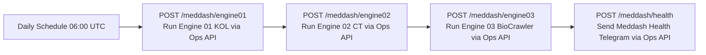

Granular steps:

1. n8n schedule fires at 06:00 UTC.
2. n8n HTTP Request calls `POST http://127.0.0.1:8765/meddash/engine01`.
3. Ops API runs `python3 meddash_pipeline_runner.py engine01`.
4. Runner executes bounded scheduled KOL command in `01_KOL_Data_Engine/`: `python3 nightly_scheduler.py --max-targets 5 --max-results 5 --skip-disambiguation --skip-weights --skip-centrality --json-summary`.
5. KOL engine updates local KOL/publication freshness and `kol_pipeline_summary.json`; full disambiguation/weights/centrality remain manual/deep lanes.
6. n8n calls `POST /meddash/engine02`.
7. Ops API runs `python3 meddash_pipeline_runner.py engine02`.
8. Runner executes `python3 ct_crawler.py --mode delta --hours 24` in `02_CT_Data_Engine/`.
9. CT engine updates local trial raw/structured data and `ct_crawler_summary.json`, the canonical CT health summary file.
10. n8n calls `POST /meddash/engine03`.
11. Ops API runs `python3 meddash_pipeline_runner.py engine03`.
12. Runner executes `python3 biocrawler.py --mode test` in `03_BioCrawler_GTM/`.
13. BioCrawler updates local biotech company/lead intelligence.
14. n8n calls `POST /meddash/health`.
15. Ops API reads local summary JSONs and SQLite counts.
16. Ops API sends Telegram health text to Dr. Don.
17. n8n execution ends.

### 3.2 CQ-Free Newsletter 1100

Workflow ID: `dfb3zednYhdcdqxE`
Current DB active flag: `0`
Schedule node: `Daily Schedule 11:00 UTC`
Purpose: refresh ticker spine, run CQ catalyst detection, trigger Paperclip Selector + Monitor, send latest report.

Live node chain after final patch:

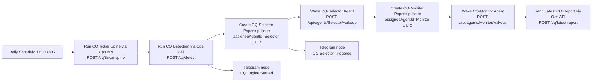

Granular steps:

1. n8n schedule fires at 11:00 UTC.
2. n8n calls `POST http://127.0.0.1:8765/cq/ticker-spine`.
3. Ops API runs `python3 cq_pipeline_runner.py ticker_spine`.
4. CQ runner runs `build_biotech_ticker_registry.py`.
5. Ticker spine refreshes Alpha Vantage listing data + SEC ticker/CIK map.
6. Ticker spine writes/upserts:
   - `biotech_tickers`
   - `biotech_ticker_aliases`
   - `biocrawler_ticker_matches`
7. n8n calls `POST http://127.0.0.1:8765/cq/detect`.
8. Ops API runs `python3 cq_pipeline_runner.py detect`.
9. CQ runner performs optional/non-fatal refreshes first:
   - `build_biotech_ticker_registry.py`
   - `pull_yahoo_ticker_news.py 40`
10. Yahoo RSS collector stores link-level metadata only:
   - `cq_market_sentiment`
   - `cq_market_events`
11. CQ runner runs required Phase 1 detection scripts:
   - `sec_8k_monitor.py`
   - `fda_pdufa_tracker.py`
   - `pr_wire_aggregator.py`
12. SEC/FDA/PR scripts read verified ticker-spine targets/aliases rather than unsafe `biotech_leads.ticker` guesses. SEC 8-K is bounded with per-request timeout and `CQ_SEC_MAX_TICKERS` daily cap.
13. Scripts write catalyst/news/event data to Supabase tables where implemented.
14. Ops API sends Telegram: CQ detection finished.
15. n8n creates a Paperclip issue for CQ-Selector:
   - URL: `POST http://localhost:3100/api/companies/cf39ae28-5bd5-44d1-b888-b01f83192fd5/issues`
   - Title: `CQ Daily Catalyst Selection`
   - Priority: `high`
   - Assignment: `assigneeAgentId = 31049770-807e-4e82-9a87-15ccdb43845f`
16. n8n sends Telegram side alert: `CQ Engine Started`.
17. n8n wakes CQ-Selector explicitly:
   - `POST http://localhost:3100/api/agents/31049770-807e-4e82-9a87-15ccdb43845f/wakeup`
18. n8n sends Telegram side alert: `CQ Selector Triggered`.
19. n8n creates Paperclip issue for CQ-Monitor:
   - Title: `CQ Daily QA Verification`
   - Priority: `medium`
   - Assignment: `assigneeAgentId = bb9deb04-97d7-4f35-89bc-130f67d8f759`
20. n8n wakes CQ-Monitor explicitly:
   - `POST http://localhost:3100/api/agents/bb9deb04-97d7-4f35-89bc-130f67d8f759/wakeup`
21. n8n calls `POST /cq/latest-report`.
22. Ops API reads newest `cq-daily-update-*.md` from:
   - `/mnt/c/Users/email/.gemini/antigravity/CEO Notes/CQ Daily Update/`
23. Ops API sends CQ daily update preview to Telegram.
24. Paperclip agents continue issue processing, research, selection, writing, and logging asynchronously.

### 3.3 Meddash Command Listener

Workflow ID: `VgOjInsEaeFBDIR9`
Current DB active flag: `0`
Schedule node: `Every 10 Seconds`
Purpose: poll Telegram commands through local Ops API, avoiding Telegram webhooks.

Live node chain:

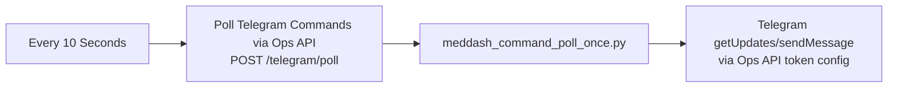

Granular steps:

1. n8n schedule fires every 10 seconds.
2. n8n calls `POST http://127.0.0.1:8765/telegram/poll`.
3. Ops API runs `python3 meddash_command_poll_once.py`.
4. Poller reads Telegram updates using local offset file:
   - `/tmp/meddash_telegram_offset.txt`
5. Poller parses supported slash commands.
6. Poller sends response through Telegram HTTP API.
7. Poller saves latest processed offset.

### 3.4 Disabled/Old n8n Workflow

Workflow: `Meddash Command Listener OLD DISABLED`
ID: `15007d29-ce68-4422-842d-006c9023ee5c`
Status: inactive old design.

Reason it is no longer canonical:

- Used Code nodes.
- Had direct Telegram logic.
- Replaced by HTTP-only `Meddash Command Listener` using Ops API.

---

## 4. Local Ops API — Execution Router

Path:

`/mnt/c/Users/email/.gemini/antigravity/Meddash_organized_backend/07_DevOps_Observability/meddash_ops_api.py`

Host/port:

`http://127.0.0.1:8765`

Routes:

| Method | Route | Action |
|---|---|---|
| GET | `/health` | Return Ops API health JSON. |
| POST | `/telegram/test` | Send Telegram test message. |
| POST | `/telegram/poll` | Run Telegram command poller. |
| POST | `/meddash/engine01` | Run bounded scheduled KOL lane via Meddash runner; verified success in `122.95s`. |
| POST | `/meddash/engine02` | Run CT delta engine via Meddash runner. |
| POST | `/meddash/engine03` | Run bounded BioCrawler via Meddash runner. |
| POST | `/meddash/health` | Read local summaries/DB counts and send Telegram health report. |
| POST | `/cq/ticker-spine` | Run CQ ticker-spine refresh only. |
| POST | `/cq/detect` | Run ticker spine + Yahoo news + SEC/FDA/PR detectors. |
| POST | `/cq/latest-report` | Send latest CQ report preview to Telegram. |

Important implementation details:

- Uses `ThreadingHTTPServer`.
- Wraps subprocesses with timeout and captures stdout/stderr tail.
- Handles `BrokenPipeError` and `ConnectionResetError` so n8n/browser disconnections do not crash API.
- Centralizes Telegram sends so scripts do not scatter stale bot logic.
- Does not expose secrets in output.

---

## 5. Meddash Pipeline Internals

Meddash runner:

`/mnt/c/Users/email/.gemini/antigravity/Meddash_organized_backend/07_DevOps_Observability/meddash_pipeline_runner.py`

Environment injected by runner:

- `MEDDASH_ROOT=/mnt/c/Users/email/.gemini/antigravity/Meddash_organized_backend`
- `PYTHONPATH=/mnt/c/Users/email/.gemini/antigravity/Meddash_organized_backend/07_DevOps_Observability`
- `DISABLE_INTERNAL_TELEGRAM=1`

### 5.1 Engine 01 — KOL Data Engine

Path:

`/mnt/c/Users/email/.gemini/antigravity/Meddash_organized_backend/01_KOL_Data_Engine/`

n8n call:

`POST /meddash/engine01`

Runner command:

`python3 nightly_scheduler.py --max-targets 5 --max-results 5 --skip-disambiguation --skip-weights --skip-centrality --json-summary`

This is the scheduled freshness lane. Full/deep KOL rebuilds remain manual/supervised because they can process hundreds of BioCrawler targets, PubMed pulls, disambiguation, weights, and centrality.

Key scripts:

| Script | Role |
|---|---|
| `nightly_scheduler.py` | Master KOL scheduler/orchestrator; now supports bounded scheduled args `--max-targets`, `--skip-disambiguation`, and `--skip-weights`. |
| `run_pipeline.py` | Core KOL pipeline runner; supports skipping full-DB disambiguation/weights for scheduled lane. |
| `extract_publications.py` | NCBI/PubMed/ORCID extraction with process-wide PubMed socket timeout via `MEDDASH_PUBMED_TIMEOUT` default `20s`. |
| `db_ingestion.py` | ORCID-first upsert to local KOL DB. |
| `kol_disambiguator.py` | Coauthor/MeSH/name/temporal KOL disambiguation. |
| `kol_weight.py` | Publication/journal weighting. |
| `review_disambiguations.py` | Gemini review for ambiguous identities. |
| `load_sjr.py` | SCImago/SJR journal metric loading. |
| `mesh_rotation.py` | Disease/category rotation. |

Outputs:

- Local SQLite: `meddash_kols.db`
- Summary JSON: `kol_pipeline_summary.json`
- Downstream: dashboard/product briefs/Supabase migration paths.

### 5.2 Engine 02 — Clinical Trials Data Engine

Path:

`/mnt/c/Users/email/.gemini/antigravity/Meddash_organized_backend/02_CT_Data_Engine/`

n8n call:

`POST /meddash/engine02`

Runner command:

`python3 ct_crawler.py --mode delta --hours 24`

Key scripts:

| Script | Role |
|---|---|
| `ct_crawler.py` | ClinicalTrials.gov v2 crawl; writes `ct_crawler_summary.json`, which is the canonical CT summary file consumed by Ops API health. |
| `ct_ingestion.py` | JSON/raw trials to normalized SQLite tables. |
| `ct_mesh_mapper.py` | Condition → MeSH mapping. |
| `ct_kol_bridge.py` | Investigator ↔ KOL bridge. |
| `ct_results_parser.py` | Outcomes/adverse events parser. |
| `ct_pub_bridge.py` | Trial ↔ publication bridge. |
| `ct_eligibility_parser.py` | Eligibility/biomarker/stage parser. |
| `ct_initializer.py` | Initial DB/setup tasks. |

Important operational note:

- Current scheduled runner executes the crawler step only (`ct_crawler.py --mode delta --hours 24`).
- Full CT freshness may require explicit ingestion and MeSH mapping depending on current script behavior/output path.
- This must remain visible in architecture because raw crawl without ingestion can leave `ct_trials.db` stale.

Outputs:

- Local SQLite: `ct_trials.db`
- Summary JSON: `ct_crawler_summary.json`
- Trial tables feed KOL briefs, TA landscapes, dashboard, and clinical-event context.

### 5.3 Engine 03 — BioCrawler GTM

Path:

`/mnt/c/Users/email/.gemini/antigravity/Meddash_organized_backend/03_BioCrawler_GTM/`

n8n call:

`POST /meddash/engine03`

Runner command:

`python3 biocrawler.py --mode test`

Why bounded mode:

- `--mode all` can exceed n8n/Ops API windows because deep enrichment includes slow external checks and sleeps.
- The workflow-safe daily path is `--mode test`.
- Full deep crawling should be manual/supervised, not inside daily n8n chain.

Key scripts:

| Script | Role |
|---|---|
| `biocrawler.py` | Company intelligence crawler. |
| `bridge_engine.py` | SVS/advisory-board mapping. |
| `export_all_leads_to_sheets.py` | Export all leads to Google Sheets. |
| `pull_from_sheets.py` | CRM/contact reverse sync from Google Sheets. |
| `manual_url_ingest.py` | Manual company URL ingestion. |
| `push_to_sheets.py.DISABLED` | Old top-20 export, retired. |

Outputs:

- Local SQLite: `biocrawler_leads.db`
- Supabase: `biotech_leads` through sync/export paths
- Google Sheet: `Biocrawler Biotech List`
- Product use: Meddash outreach/GTM, company context, reverse matching to ticker spine.

---

## 6. Clinical Quant Pipeline Internals

CQ runner:

`/mnt/c/Users/email/.gemini/antigravity/CTO/CQ_Team/scripts/cq_pipeline_runner.py`

Commands:

| Command | Meaning |
|---|---|
| `ticker_spine` | Run canonical ticker registry refresh. |
| `yahoo_ticker_news` | Pull Yahoo Finance RSS link metadata. |
| `detect` | Run ticker spine + Yahoo news + SEC/FDA/PR detectors. |
| `select_file` | Find latest CQ daily update markdown. |

### 6.1 CQ Ticker Spine

Scripts:

- `scripts/market_data/apply_ticker_spine_schema.py`
- `scripts/market_data/create_ticker_spine_schema.sql`
- `scripts/market_data/build_biotech_ticker_registry.py`

Data sources:

- Alpha Vantage listing status
- SEC company tickers/CIK map
- Existing BioCrawler local/Supabase company names for exact reverse matching

Tables written:

- `biotech_tickers`
- `biotech_ticker_aliases`
- `biocrawler_ticker_matches`

Current verified counts:

| Table | Count |
|---|---:|
| `biotech_tickers` | 13,257 |
| `biotech_ticker_aliases` | 13,257 |
| `biocrawler_ticker_matches` | 194 |

Match policy:

1. Exact ticker + exchange.
2. Exact CIK.
3. Exact normalized company/legal name.
4. Reviewed high-confidence alias.
5. Fuzzy match only as a suggestion/candidate; never production auto-write.

Current result:

- 126 exact BioCrawler/company-name matches.
- 68 existing BioCrawler ticker candidates.
- Zero fuzzy auto-writes.

### 6.2 Yahoo Finance RSS Link Collector

Script:

`/mnt/c/Users/email/.gemini/antigravity/CTO/CQ_Team/scripts/market_data/pull_yahoo_ticker_news.py`

n8n/Ops path:

- Runs inside `/cq/detect`.
- Can also be run by `cq_pipeline_runner.py yahoo_ticker_news`.

Input:

- Verified ticker spine exact matches first.

External source:

`https://feeds.finance.yahoo.com/rss/2.0/headline?s={TICKER}&region=US&lang=en-US`

Output policy:

- Store metadata and links only.
- Do not hoard full article text unless product reason exists.
- CQ-Selector reads selected links and summarizes later.

Tables written:

| Table | Count |
|---|---:|
| `cq_market_sentiment` | 111 |
| `cq_market_events` | 111 |

### 6.3 SEC 8-K Monitor

Script:

`/mnt/c/Users/email/.gemini/antigravity/CTO/CQ_Team/scripts/phase1_regulatory/sec_8k_monitor.py`

Current source policy:

- Reads verified ticker-spine targets.
- Does not rely on fuzzy `biotech_leads.ticker` guesses.

External source:

- SEC EDGAR/RSS/company filing signals.

Purpose:

- Detect material regulatory/company catalyst filings.
- Feed CQ catalyst intelligence and newsletter selection.

### 6.4 FDA PDUFA Tracker

Script:

`/mnt/c/Users/email/.gemini/antigravity/CTO/CQ_Team/scripts/phase1_regulatory/fda_pdufa_tracker.py`

Current source policy:

- Reads ticker-spine aliases/company-name map.
- Avoids fuzzy BioCrawler ticker writes.

External source:

- FDA calendars/advisory/PDUFA sources.

Purpose:

- Detect upcoming FDA dates or regulatory catalyst changes.

### 6.5 PR Wire Aggregator

Script:

`/mnt/c/Users/email/.gemini/antigravity/CTO/CQ_Team/scripts/phase1_regulatory/pr_wire_aggregator.py`

Current source policy:

- Reads exact reverse matches from `biocrawler_ticker_matches`.
- Uses verified ticker spine exact matches for company/news matching.

External sources currently retained:

- PRNewswire health latest RSS.
- GlobeNewswire Pharmaceuticals RSS.

Previously fixed failure:

- Removed bad BusinessWire HTML/non-RSS industry endpoint.
- Replaced unbounded `feedparser.parse(url)` with `requests.get(..., timeout=15)` then parse content.

Purpose:

- Detect Phase 1/clinical readout PR events.

### 6.6 Market Data Prototypes / Future Price Bars

Scripts:

| Script | Status |
|---|---|
| `phase3_sentiment/alpha_vantage_tracker.py` | Prototype; credentials present; not core production write path now because ticker-spine handles listing status and Yahoo handles link metadata. |
| `phase4_quant/massive_tracker.py` | Prototype/reserved; target table `cq_price_bars` exists but count is 0. |

Table reserved:

- `cq_price_bars`

Rule:

- Do not mature Massive/price ingestion until it is bounded, ticker_id-linked, and does not slow the daily CQ workflow.

---

## 7. Current Data Stores and Counts

### 7.1 Local SQLite Databases

| DB | Path | Tables / current counts |
|---|---|---|
| BioCrawler | `06_Shared_Datastores/biocrawler_leads.db` | `biotech_leads`: 658; `associated_kols`: 448; `biotech_associated_kols`: 448; `crm_contacts`: 0 |
| CT Trials | `06_Shared_Datastores/ct_trials.db` | `trials`: 1005; `trial_conditions`: 2268; `trial_interventions`: 1938; `trial_sponsors`: 1628; `trial_sites`: 15555; `trial_investigators`: 831; `trial_outcomes`: 7391; `trial_results`: 462; `trial_publications`: 1231; `trial_eligibility`: 1004; `condition_mesh_map`: 15 |
| KOLs | `06_Shared_Datastores/meddash_kols.db` | `kols`: 8298; `mesh_ontology`: 2542; `publications`: 877; `kol_authorships`: 7977; `publication_mesh_map`: 9779; `journal_metrics`: 31125; `kol_merge_candidates`: 230 |

### 7.2 Summary / State Files

Folder:

`/mnt/c/Users/email/.gemini/antigravity/Meddash_organized_backend/06_Shared_Datastores/pipeline_summaries/`

Expected summary files:

- `kol_pipeline_summary.json`
- `ct_crawler_summary.json`
- `biocrawler_summary.json`

State/log folder:

`/mnt/c/Users/email/.gemini/antigravity/Meddash_organized_backend/06_Shared_Datastores/pipeline_state/`

Expected run logs:

- `pipeline_run_YYYY-MM-DD_HHMMSS.json`
- MeSH rotation state JSONs where used.

### 7.3 Supabase Tables

Connected from CQ `.env` through `SUPABASE_URI` / REST credentials. Values are not recorded.

Current verified counts:

| Table | Count | Role |
|---|---:|---|
| `biotech_leads` | 640 | Supabase company/lead table synced from BioCrawler path. |
| `cq_regulatory_catalysts` | 0 | CQ regulatory catalyst target table; currently no rows. |
| `biotech_tickers` | 13,257 | Canonical ticker/security registry. |
| `biotech_ticker_aliases` | 13,257 | Alias/name table tied to ticker IDs. |
| `biocrawler_ticker_matches` | 194 | Reverse BioCrawler ↔ ticker spine matches/candidates. |
| `cq_market_sentiment` | 111 | Link-level market/news metadata from Yahoo RSS. |
| `cq_price_bars` | 0 | Future Massive/price-bar ingestion target. |
| `cq_market_events` | 111 | Link-level event table for CQ Selector. |

### 7.4 Ticker-Spine Relationship Map

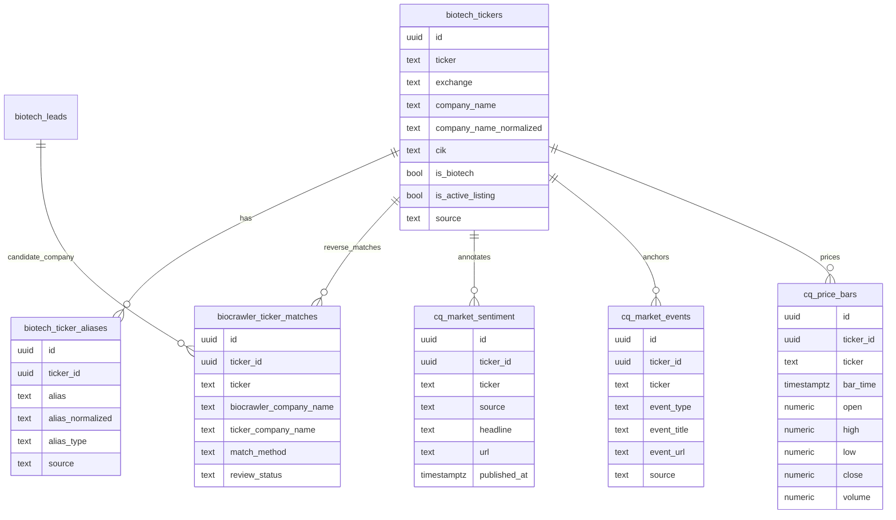

---

## 8. Paperclip Agent Architecture

Paperclip endpoint:

`http://127.0.0.1:3100`

Company ID:

`cf39ae28-5bd5-44d1-b888-b01f83192fd5`

Current live agent roster from API: 12 agents.

| Agent | ID | Role | Reports To | Provider | Model | Heartbeat |
|---|---|---|---|---|---|---|
| CQ-COO | `d69fface-4475-4166-aa9d-f26acbcd12d2` | CEO/COO | none | ollama-cloud | glm-5.1 | 7200s |
| CQ-CTO | `1ad999cb-a7f2-4464-8d3a-701e04951ff6` | CTO | CQ-COO | ollama-cloud | glm-5.1 | 14400s |
| CQ-Selector(CQ.FNL) | `31049770-807e-4e82-9a87-15ccdb43845f` | PM/editor | CQ-COO | ollama-cloud | glm-5 | 3600s |
| CQ-Researcher(CQ.FNL) | `26105f52-560b-4ac3-afb7-4df51f0de0fb` | Researcher | CQ-Selector | ollama-cloud | kimi-k2.5 | 7200s |
| CQ-Monitor(CQ-FNL) | `bb9deb04-97d7-4f35-89bc-130f67d8f759` | QA | CQ-CTO | ollama-cloud | ministral-3:3b | 7200s |
| Meddash-COO | `ca4c3f1a-dd15-43c4-8ae2-498b3a839273` | CEO/COO | none | ollama-cloud | glm-5 | 300s legacy config |
| Meddash-CTO | `9511e1ea-def0-4c0b-a78b-7d9f63cae6a2` | CTO | Meddash-COO | ollama-cloud | glm-5.1 | 3600s/legacy mixed config |
| Meddash-Monitor | `2f72ef2a-f8da-41ba-a41c-b1a20080ba55` | QA | Meddash-CTO | ollama-cloud | deepseek-v4-flash | 7200s |
| Meddash-CQ-Dashboard-Monitor | `b04b8342-527c-4ceb-abee-bf44dade4fe7` | DevOps | Meddash-CTO | ollama-cloud | ministral-3:3b | 1800s |
| Meddash-CMO | `45d700f5-3451-48a6-b6e6-a0e211040a60` | CMO | Meddash-COO | ollama-cloud | glm-4.7 | 14400s |
| Meddash-CQ File Index Agent | `26dd7a48-4682-437a-8491-89a1bbb2332f` | Librarian | Meddash-COO | ollama-cloud | qwen2.5:7b | 14400s |
| Meddash-Eye(Researcher/Analyst) | `ef38de08-972a-4b7d-9ff7-c00bdba02950` | Researcher | Meddash-COO | ollama-cloud | glm-5 | 7200s |

### 8.1 Paperclip Org Mermaid

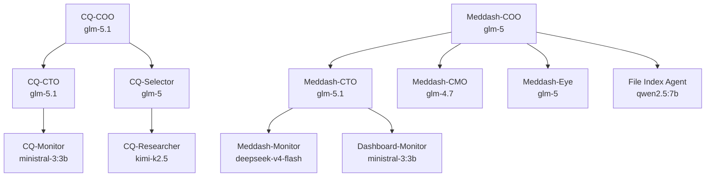

### 8.2 Paperclip Trigger Rules

Correct n8n-to-Paperclip sequence:

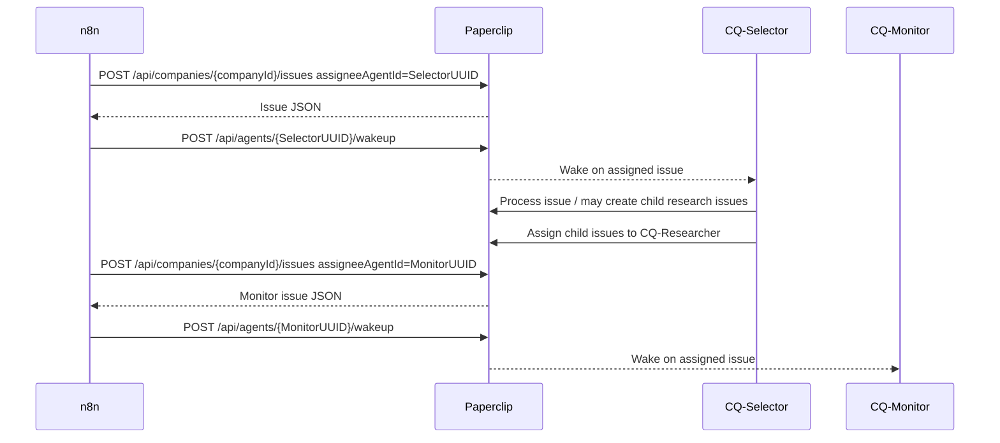

Never use:

- `assignee` short field.
- Display names as assignees.
- Short IDs like `31049770`.
- Issue creation without wakeup if deterministic execution is expected.

This was corrected in the live CQ n8n workflow during architecture capture.

---

## 9. Telegram Architecture

Telegram is used in three ways:

1. Ops API sends centralized health/cq/report messages.
2. n8n CQ workflow has two direct Telegram send nodes:
   - `CQ Engine Started`
   - `CQ Selector Triggered`
3. n8n Command Listener polls Telegram commands through Ops API instead of Telegram Trigger.

Why no Telegram Trigger:

- Telegram webhooks require public HTTPS.
- This system runs on localhost/WSL.
- Therefore Telegram Trigger causes `bad webhook: HTTPS URL required`.

Canonical pattern:

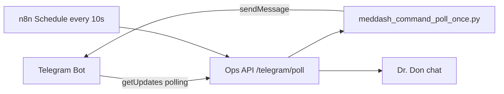

---

## 10. Obsidian / Hermes / SWIP Memory Layer

Canonical vault:

`/mnt/c/Users/email/Hermes Agent Win Files/`

Must-read files for deep project work:

- `SCHEMA.md`
- `index.md`

Core architecture pages:

| Page | Role |
|---|---|
| `concepts/cq-triarchy-architecture.md` | n8n/Paperclip/Alfred/Vault operating model. |
| `concepts/cq-quariarchy-architecture.md` | Adds Agent Zero CQ as fourth pillar. |
| `concepts/meddash-data-spine.md` | Older data-spine reference; now superseded for ticker direction by this architecture. |
| `reference/meddash-backend-map.md` | Backend scripts, engines, DB map. |
| `projects/clinical-quant/newsletter-pipeline-design.md` | CQ newsletter design history. |
| `projects/clinical-quant/newsletter/` | CQ daily brief drafts. |
| `projects/clinical-quant/posted-events-log.md` | Dedup log for published catalyst/news items. |

Operational index:

`/mnt/c/Users/email/.gemini/antigravity/Meddash Phase 3 Automation Observation and Sales/MDP3-SWIP4.md`

This architecture file is the current consolidated map; SWIP4 remains the step-by-step implementation ledger.

---

## 11. Agent Zero CQ / A2A Pillar

Reference architecture says Agent Zero CQ is the fourth pillar for conversational ideation/research/planning.

Known paths/endpoints:

| Item | Value |
|---|---|
| Container/workspace name | `agent-cq` |
| UI endpoint | `http://127.0.0.1:5081/` |
| A2A endpoint | `http://127.0.0.1:5081/a2a/` |
| Workspace path | `/mnt/c/Users/email/agent-zero/agent-CQ` |

Current constraint from vault:

- A0-CQ has stale/non-functional model endpoints in multi-LLM config.
- Until cleaned and verified, treat A2A as reference/future pillar, not part of deterministic daily Meddash/CQ production chain.

---

## 12. External Data Sources

| Source | Used By | Current role |
|---|---|---|
| PubMed / NCBI E-utilities | KOL engine | Publications and biomedical expert signal. |
| ORCID | KOL engine | Identity/disambiguation support. |
| SCImago / journal metrics | KOL engine | Publication weight and impact. |
| ClinicalTrials.gov API v2 | CT engine | Trial records and updates. |
| SEC EDGAR / SEC ticker map | CQ ticker spine + SEC monitor | CIK mapping, listed company identity, SEC event detection; SEC monitor now uses bounded per-request timeout and daily scan cap. |
| FDA calendars/pages | FDA tracker | PDUFA/advisory/regulatory dates. |
| PRNewswire RSS | PR aggregator | PR catalyst discovery. |
| GlobeNewswire RSS | PR aggregator | PR catalyst discovery. |
| Yahoo Finance RSS | CQ market news | Link-level ticker news metadata. |
| Alpha Vantage listing status | CQ ticker spine | Listed-security registry source. |
| Massive | Future CQ price bars | Prototype only; `cq_price_bars` ready but unpopulated. |
| Google Sheets | BioCrawler CRM/GTM | Lead export/reverse sync. |
| Telegram Bot API | Ops API + n8n | Alerts, health, command polling. |
| Supabase Postgres/REST | Meddash/CQ shared cloud DB | Shared production-ish data spine. |

---

## 13. Disabled / Deprecated / Guarded Paths

| Path / pattern | Status | Reason |
|---|---|---|
| `CTO/CQ_Team/scripts/enrich_tickers.py` | Guard stub only | Old fuzzy ticker enrichment disabled. |
| `CTO/CQ_Team/scripts/enrich_tickers.py.DISABLED_FUZZY_DO_NOT_RUN` | Archived original | Previously attempted BioCrawler company-name → ticker fuzzy writes. Do not run. |
| BioCrawler company name → ticker fuzzy auto-write | Forbidden | Produced wrong ticker mappings and non-listed company confusion. |
| Direct `feedparser.parse(url)` remote fetch | Forbidden in production CQ | Can hang; use bounded `requests.get(..., timeout=15)` first. SEC and PR lanes must also use explicit request timeouts and bounded scan caps. |
| BusinessWire HTML industry page as RSS | Disabled | Was not a reliable RSS endpoint and caused PR Wire timeout. |
| n8n Telegram Trigger on localhost | Forbidden | Telegram requires HTTPS webhook. |
| n8n Code nodes with `require()` | Avoid | Sandbox blocks modules. |
| n8n Execute Command nodes | Avoid in current install | Disabled/unrecognized in n8n 2.x environment. |
| Scattered internal script Telegram sends | Avoid | Centralize in Ops API; set `DISABLE_INTERNAL_TELEGRAM=1`. |
| `push_to_sheets.py` old top-20 flow | Disabled/retired | Replaced by all-leads export/import workflow. |

---

## 14. Current End-to-End Sequence — Meddash Daily

```mermaid
sequenceDiagram
    participant Clock as n8n Schedule 06:00 UTC
    participant Ops as Ops API :8765
    participant Runner as meddash_pipeline_runner.py
    participant KOL as KOL Engine
    participant CT as CT Engine
    participant BIO as BioCrawler
    participant DB as Local SQLite/Summary JSON
    participant TG as Telegram

    Clock->>Ops: POST /meddash/engine01
    Ops->>Runner: python3 meddash_pipeline_runner.py engine01
    Runner->>KOL: bounded nightly_scheduler.py --max-targets 5 --max-results 5 --skip-disambiguation --skip-weights --skip-centrality
    KOL->>DB: update meddash_kols.db + kol_pipeline_summary.json

    Clock->>Ops: POST /meddash/engine02
    Ops->>Runner: python3 meddash_pipeline_runner.py engine02
    Runner->>CT: python3 ct_crawler.py --mode delta --hours 24
    CT->>DB: update CT raw + ct_crawler_summary.json; health reads this exact filename

    Clock->>Ops: POST /meddash/engine03
    Ops->>Runner: python3 meddash_pipeline_runner.py engine03
    Runner->>BIO: python3 biocrawler.py --mode test
    BIO->>DB: update biocrawler_leads.db + summary

    Clock->>Ops: POST /meddash/health
    Ops->>DB: read summaries + DB counts
    Ops->>TG: send health report
```

---

## 15. Current End-to-End Sequence — CQ Daily

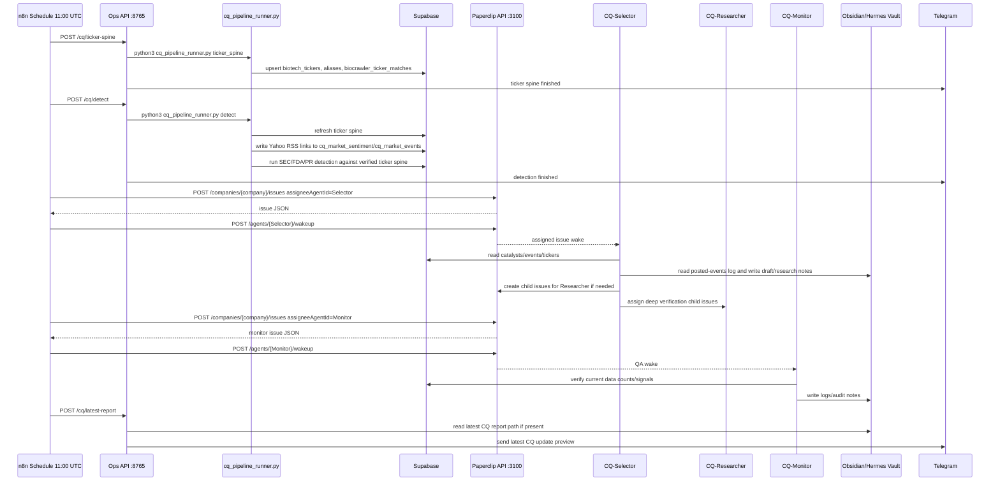

---

## 16. Product Output Layer

### 16.1 Meddash Product Outputs

| Product | Source dependencies | Output |
|---|---|---|
| KOL Brief | KOL DB + CT DB + BioCrawler/company context | `$2,450` style KOL intelligence brief. |
| TA Landscape | CT DB + KOL DB + ontology mapping | Therapeutic-area report. |
| GTM Lead Sheet | BioCrawler DB + Google Sheets | Outreach/CRM target list. |
| Dashboard | Local SQLite + Supabase | Streamlit factory-floor dashboard, port 5090. |

### 16.2 Clinical Quant Outputs

| Product | Source dependencies | Output |
|---|---|---|
| CQ Daily Brief | ticker spine + SEC/FDA/PR/Yahoo + Paperclip selection/research | Daily catalyst/newsletter draft. |
| CQ Market Events | Yahoo RSS + verified ticker IDs | Link/event intelligence for Selector. |
| CQ Research Notes | Paperclip Researcher + vault | Deep catalyst verification notes. |
| CQ Telegram Update | Ops API latest report sender | Preview to Dr. Don. |

Manual publishing remains human-controlled:

- Dr. Don reviews drafts.
- Dr. Don copies to Substack/LinkedIn.
- No automated LinkedIn spam/browser automation.

---

## 17. Guardrails / What Not To Do

1. Do not auto-write fuzzy ticker matches.
2. Do not run SEC/news/price pulls from unverified BioCrawler ticker guesses.
3. Do not use BioCrawler company name as market-security source of truth.
4. Do not scrape Yahoo Finance web pages directly if RSS works.
5. Do not store full article text unless product reason exists.
6. Do not reintroduce BusinessWire HTML page as PR RSS.
7. Do not let n8n execute shell scripts directly in this install.
8. Do not use n8n Telegram Trigger on localhost.
9. Do not write n8n credentials directly into SQLite.
10. Do not patch Supabase destructively without explicit confirmation.
11. Do not use Paperclip `assignee` or short agent IDs.
12. Do not create Paperclip issue without wakeup when deterministic action is required.
13. Do not rely on DB `active=1` alone to start n8n triggers; use UI toggle after workflow DB edits.
14. Do not restart/kill broad n8n processes without user approval if previously denied.
15. Do not print or preserve secrets in docs.

---

## 18. Current Known Gaps / Watch Items

| Gap | Severity | Explanation | Next action |
|---|---|---|---|
| n8n active flags are 0 | High operational | Workflows exist and are patched, but schedules will not fire until activated/toggled in UI. | Open n8n UI, hard refresh, toggle intended workflows active. |
| CT health filename mismatch | Fixed | Ops API previously looked for non-existent `ct_delta_summary.json`. | Corrected to read `ct_crawler_summary.json` under logical `ct_delta` key. |
| `cq_price_bars` empty | Low/currently acceptable | Massive/price ingestion not yet productionized. | Add bounded Massive stage later if product needs price context. |
| `cq_regulatory_catalysts` empty | Medium | Detectors pass but latest check found no catalyst rows. | Monitor after real market day / expand detectors if needed. |
| A0-CQ model endpoints stale | Low for daily pipeline | Agent Zero CQ is not in deterministic n8n chain. | Clean model config before using A2A in production. |
| Internal per-engine Telegram 404 noise | Low/cleanup | KOL/CT internals can still emit stale Telegram HTTP 404 despite centralized Ops API Telegram working. | Keep `DISABLE_INTERNAL_TELEGRAM=1`; remove/clean internal notifier calls later. |

---

## 19. File/Path Index

### Meddash Phase 3 folder

`/mnt/c/Users/email/.gemini/antigravity/Meddash Phase 3 Automation Observation and Sales/`

Key files:

- `MDP3-SWIP4.md`
- `mdp3.architecture.20260429-0215.md` ← this file

### Meddash backend

`/mnt/c/Users/email/.gemini/antigravity/Meddash_organized_backend/`

Important subfolders:

- `01_KOL_Data_Engine/`
- `02_CT_Data_Engine/`
- `03_BioCrawler_GTM/`
- `04_Product_KOL_Briefs/`
- `05_Product_TA_Landscape/`
- `06_Shared_Datastores/`
- `07_DevOps_Observability/`
- `08_MDM_Ontology_Engine/`
- `09_Scholar_Engine/`
- `10_KOL_Centrality_Engine/`

### CQ team scripts

`/mnt/c/Users/email/.gemini/antigravity/CTO/CQ_Team/scripts/`

Important subfolders/scripts:

- `cq_pipeline_runner.py`
- `market_data/build_biotech_ticker_registry.py`
- `market_data/pull_yahoo_ticker_news.py`
- `market_data/apply_ticker_spine_schema.py`
- `market_data/create_ticker_spine_schema.sql`
- `phase1_regulatory/sec_8k_monitor.py`
- `phase1_regulatory/fda_pdufa_tracker.py`
- `phase1_regulatory/pr_wire_aggregator.py`
- `phase3_sentiment/alpha_vantage_tracker.py`
- `phase4_quant/massive_tracker.py`
- `enrich_tickers.py` guard stub
- `enrich_tickers.py.DISABLED_FUZZY_DO_NOT_RUN` archived old fuzzy logic

### Hermes vault

`/mnt/c/Users/email/Hermes Agent Win Files/`

Important architecture refs:

- `SCHEMA.md`
- `index.md`
- `concepts/cq-triarchy-architecture.md`
- `concepts/cq-quariarchy-architecture.md`
- `concepts/meddash-data-spine.md`
- `reference/meddash-backend-map.md`
- `projects/clinical-quant/newsletter-pipeline-design.md`

### Paperclip instruction/log roots

- `~/.paperclip/instances/default/companies/cf39ae28-5bd5-44d1-b888-b01f83192fd5/agents/`
- `/mnt/c/Users/email/Hermes Agent Win Files/Meddash-Paper Clip Agent Logs/`
- `/mnt/c/Users/email/Hermes Agent Win Files/CQ-Paper Clip Agent Logs/`

---

## 20. Mermaid Map — Current Trigger Surface

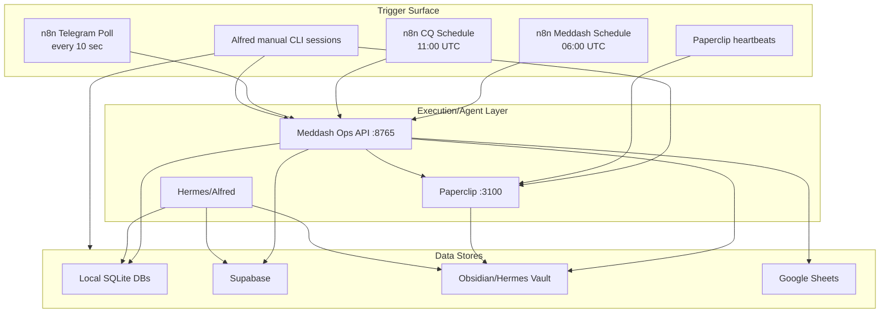

---

## 21. Final Canonical Data Direction

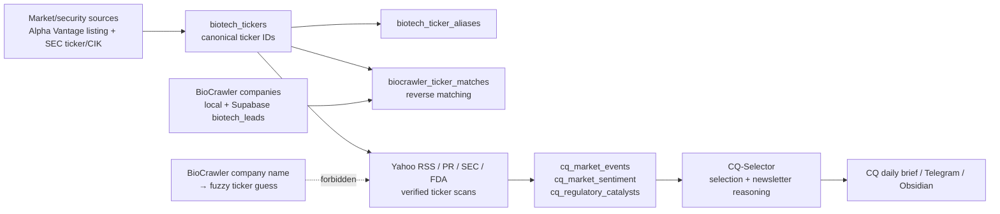

This is the final identity-spine rule for the system.

---

## 22. Verification Notes Captured During This Architecture Pass

Actions taken during architecture capture:

1. Read canonical Hermes vault `SCHEMA.md` and `index.md`.
2. Read Meddash backend map, data spine, and CQ newsletter pipeline design.
3. Inspected live n8n SQLite workflows, nodes, connections, and active flags.
4. Inspected live Ops API route map and runner files.
5. Pulled Paperclip live agent roster from API.
6. Verified n8n HTTP 200, Ops API health OK, Paperclip HTTP 200.
7. Verified Supabase table counts through existing CQ environment without printing secrets.
8. Found and fixed live CQ n8n Paperclip trigger flaw:
   - Replaced short `assignee` fields with full `assigneeAgentId` UUIDs.
   - Corrected CQ-Monitor assignment to CQ-Monitor UUID, not CQ-Researcher.
   - Added explicit `Wake CQ-Selector Agent` node.
   - Added explicit `Wake CQ-Monitor Agent` node.
9. Documented n8n activation caveat after DB patches.

---

## 23. One-Line Current Workflow Definition

Meddash/CQ current production design is:

`n8n schedule/command poll → local Ops API → bounded Python engines → local SQLite + Supabase ticker spine/events → Paperclip assigned+woken agents → Obsidian/Hermes logs/drafts → Telegram human-visible alerts → Dr. Don manual review/publish`

This is the current full architecture snapshot.

---

# Architecture Addendum — No-Loose-Ends Operational Blueprint Patch

Patched: 2026-04-29 02:30 EDT
Reason: the first blueprint captured the core live CQ/n8n/Ops/Paperclip topology, but the master map was not granular enough for an operational blueprint. This addendum explicitly maps all known external/internal data sources, crawl/API modality, deduplication engines, manual product-generation lanes, dashboard/front-end surfaces, the CQ free newsletter path, and Phase 2 architecture lineage.

## A. Complete Data Source Surface — Source, Modality, Consumer, Persistence

| # | Data source / surface | Modality | Primary consumer script/component | Persisted to | Operational notes |
|---|---|---|---|---|---|
| 1 | PubMed / NCBI E-utilities | API + XML/JSON extraction | `01_KOL_Data_Engine/extract_publications.py` | `meddash_kols.db`, Supabase `kols`, publication/authorship tables when synced | Source for publications, authors, ORCID hints, publication signal. In Phase 2 diagram this is the KOL data root. |
| 2 | ORCID identifiers inside PubMed/publication metadata | XML/metadata field, not independent crawl in current map | `kol_disambiguator.py`, `sync_scholar_citations.py` matching logic | staging/final KOL identity fields | Highest-confidence KOL disambiguation signal when present. |
| 3 | SCImago / journal metrics | local/reference data, CSV/DB style enrichment | `kol_weight.py`, `generate_kol_brief.py` joins journal metrics | `journal_metrics`, publication weight/APW fields | Used for SJR/APW quality weighting. |
| 4 | ClinicalTrials.gov v2 | API JSON | `02_CT_Data_Engine/ct_crawler.py` → `ct_ingestion.py` | `ct_trials.db`, Supabase `trials` | Root of trial, intervention, condition, sponsor, investigator, eligibility, result data. |
| 5 | ClinicalTrials.gov trial details | API JSON nested records | `ct_mesh_mapper.py`, `ct_results_parser.py`, `ct_eligibility_parser.py`, `ct_kol_bridge.py`, `ct_pub_bridge.py` | CT normalized tables: conditions/interventions/sponsors/investigators/eligibility/results | Feeds KOL brief generator and TA landscape generator. |
| 6 | BioCrawler company discovery | API mode + HTML/deep web crawl mode | `03_BioCrawler_GTM/biocrawler.py` | `biocrawler_leads.db`, Supabase `biotech_leads` | GTM lead source. Ticker field is not canonical. Old fuzzy ticker enrichment disabled. |
| 7 | Company websites / IR pages | HTML crawl / site scrape | `biocrawler.py` deep mode | `biocrawler_leads.db` | Used for lead intelligence and company enrichment, not for canonical ticker identity. |
| 8 | Clearbit / company enrichment | API-based enrichment where configured | `biocrawler.py` deep mode / GTM enrichment | `biocrawler_leads.db` | External enrichment; availability depends on credentials and script path. |
| 9 | SEC EDGAR company filings | SEC API / JSON / filing text | `phase1_regulatory/sec_8k_monitor.py`; BioCrawler deep scan references EDGAR | Supabase `cq_regulatory_catalysts`; ticker spine joins by ticker/CIK | SEC 8-K catalyst detector. Now reads canonical ticker spine, uses explicit request timeout, and scans a bounded daily ticker cap instead of hanging the CQ run. |
| 10 | SEC ticker/CIK mapping | SEC JSON/listing map | `market_data/build_biotech_ticker_registry.py` | Supabase `biotech_tickers`, `biotech_ticker_aliases` | One of the canonical ticker spine sources. |
| 11 | Alpha Vantage LISTING_STATUS | API CSV/listing source | `market_data/build_biotech_ticker_registry.py` | Supabase `biotech_tickers`, `biotech_ticker_aliases` | Produces broad verified security universe. Current run: 13,320 listing rows; 13,257 upserted securities. |
| 12 | Alpha Vantage NEWS_SENTIMENT | API JSON prototype | `phase3_sentiment/alpha_vantage_tracker.py` | Intended `cq_market_sentiment` | Prototype exists; not yet main daily production path except ticker/listing registry source. |
| 13 | Yahoo Finance ticker headline RSS | RSS/XML feed | `market_data/pull_yahoo_ticker_news.py` | Supabase `cq_market_sentiment`, `cq_market_events` | Link-level/news metadata only; no full article storage. Current stage scans bounded ticker set and stores headline/source/url/published time. |
| 14 | PR Newswire / GlobeNewswire / BusinessWire-like feeds | RSS/XML via `requests.get(..., timeout=15)` then `feedparser` | `phase1_regulatory/pr_wire_aggregator.py` | Supabase `cq_regulatory_catalysts` | PR Wire timeout fixed; bad BusinessWire HTML endpoint removed/disabled. |
| 15 | FDA/PDUFA public data | public FDA/calendar style scrape/API-like page parse depending script internals | `phase1_regulatory/fda_pdufa_tracker.py` | Supabase `cq_regulatory_catalysts` | Uses ticker spine/company aliases for mapping; analyzes verified aliases instead of fuzzy BioCrawler tickers. |
| 16 | Massive market data | API/prototype | `phase4_quant/massive_tracker.py` | Intended `cq_price_bars` | Prototype exists; table `cq_price_bars` created; not yet promoted into full production daily ingest. |
| 17 | Google Scholar via SerpApi | API + manual URL/ID mode | `09_Scholar_Engine/sync_scholar_citations.py` through `api_server.py` | `kol_scholar_metrics`, `scholar_review_queue`, KOL scholar fields | Manual lane exists for staging and final KOL rows; rate-limited/credential dependent. |
| 18 | UMLS / disease ontology APIs | API | `08_MDM_Ontology_Engine/build_disease_ontology.py` | disease criteria / ontology DB layer | Standardizes disease/criteria concepts; weekly sync in Phase 2 lineage. |
| 19 | Google Sheets CRM | Google Sheets API/manual sync | `03_BioCrawler_GTM/push_to_sheets.py`, `pull_from_sheets.py` | Google Sheet + `biocrawler_leads.db` | Sheet now used for selected lead workflow; old obsolete CRM path replaced. |
| 20 | Supabase Postgres / REST | Postgres connection + REST API | Meddash dashboard, CQ scripts, Ops API, n8n indirectly | all Supabase Meddash/CQ tables | Central cloud data layer. Credentials loaded from `.env`; values never documented. |
| 21 | Local SQLite shared datastores | local SQLite | Meddash backend engines and dashboard | `meddash_kols.db`, `ct_trials.db`, `biocrawler_leads.db`, others | Local operational/state layer for engines and product generation. |
| 22 | n8n workflow DB | local SQLite | n8n runtime | `/home/doc_victus/.n8n/database.sqlite` | Stores workflow topology. DB-level patches require UI hard refresh/re-activation. |
| 23 | Paperclip API | local HTTP API | n8n HTTP Request nodes, Alfred/Hermes operations | Paperclip issue/agent store | Agent orchestration layer. Correct assignment is `assigneeAgentId` plus explicit `/wakeup`. |
| 24 | Telegram Bot API | HTTPS bot API, centralized through Ops API | `telegram_notifier.py`, `meddash_ops_api.py` | Telegram messages only | Operational alerts for Meddash/CQ. n8n does not use Telegram nodes directly. |
| 25 | Obsidian / Hermes Agent Win Files | local markdown vault | CQ agents, Alfred, architecture, newsletter drafts | Markdown source-of-truth | Stores architecture, posted-events log, CQ newsletter drafts, research notes. |
| 26 | Substack | manual publishing | Dr. Don | external public newsletter | Manual copy/paste from Obsidian daily brief; no automated posting yet. |
| 27 | LinkedIn | manual publishing | Dr. Don | external public social post | Manual copy/paste; no automated spam. |
| 28 | X/Twitter | planned Paperclip/X bot | future CQ distribution agent | future external social output | Not yet production; guardrails required. |
| 29 | Base44 Meddash lite/search tool | separate web/front-end surface | future tab/subdomain | Base44 app/subdomain | Separate from meddash.ai marketing page and Streamlit internal dashboard. |
| 30 | Streamlit Meddash-CQ Dashboard | local web app on port 5090 | `CTO/Meddash-CQ_Dashboard/app.py` + widgets | reads Supabase + SQLite + product dirs | Operational cockpit, not the architecture rendering engine. |

## B. Master System Map With Data Sources Included

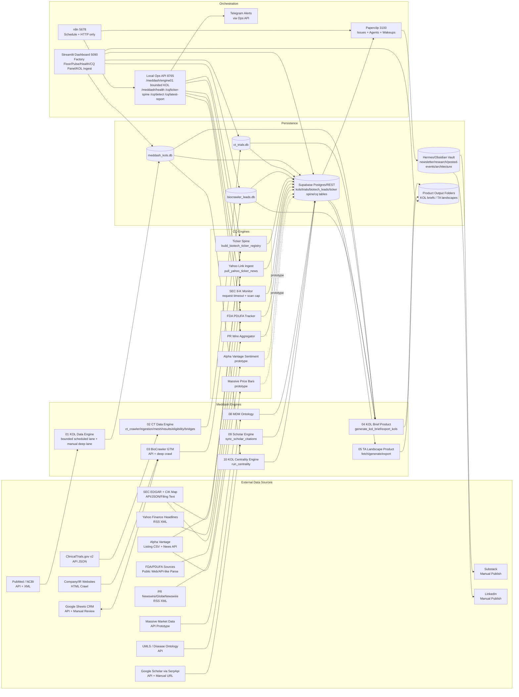

## C. Deduplication, Identity Resolution, and Duplicate Guards

| Layer | Engine / file | Duplicate problem solved | Current method | Output / dependency |
|---|---|---|---|---|
| KOL identity Tier 1 | `01_KOL_Data_Engine/kol_disambiguator.py` | Same expert appears across publication pulls | ORCID / score threshold auto-resolution | updates `kols_staging`; uncertain pairs route to `kol_merge_candidates` |
| KOL identity Tier 2 | Streamlit/Next/FastAPI sandbox via `api_server.py` endpoints | Human review needed for uncertain duplicate pairs | UI review: same/distinct/escalate | commits clean KOLs into final `kols` / local `meddash_kols.db` |
| KOL identity Tier 3 | `deep_disambiguation_needed` / review path | Ambiguous/complex duplicate cases | escalation queue | manual/LLM context review |
| Scholar identity | `09_Scholar_Engine/sync_scholar_citations.py` | Wrong Google Scholar profile matched to KOL | 4-tier matching: ORCID, exact name+institution, affiliation/specialty, manual review | `kol_scholar_metrics`, scholar status fields, review queue |
| Centrality reliability | `10_KOL_Centrality_Engine/reliability.py` | duplicate KOL records split graph centrality | applies reliability penalty when duplicate warning exists | `kol_centrality_scores` with reliability/limitations |
| Ticker identity | `market_data/build_biotech_ticker_registry.py` | BioCrawler name → ticker fuzzy mismatch | market/security source first; SEC CIK + exact normalized names; fuzzy never auto-writes | `biotech_tickers`, `biotech_ticker_aliases`, `biocrawler_ticker_matches` |
| Old ticker enrichment guard | `scripts/enrich_tickers.py` guard stub | accidental restart of old fuzzy auto-writer | original moved to `.DISABLED_FUZZY_DO_NOT_RUN`; stub blocks use | prevents mutation of `biotech_leads.ticker` by fuzzy guesses |
| CQ posted catalyst dedup | `projects/clinical-quant/posted-events-log.md` + CQ-Selector instructions | newsletter repeats same catalyst | append-only posted event ledger checked before selection | final daily brief excludes previously posted items |
| CQ source/link dedup | `pull_yahoo_ticker_news.py`, PR/feed scripts, Supabase tables | duplicate URLs/headlines across RSS/API sources | link/source/ticker-level uniqueness and bounded inserts | `cq_market_sentiment`, `cq_market_events`, `cq_regulatory_catalysts` |
| Paperclip issue dedup/trace | Paperclip issues/comments | agent work repetition / lost state | parent issue + subissue/comment history; explicit wakeup | visible task state for CQ-Selector/CQ-Monitor/Researcher |
| n8n workflow dedup | Schedule + manual trigger discipline | duplicate cron/manual runs | n8n execution history + explicit HTTP routes; no hidden script execution nodes | current workflows need UI active toggle verification |

## D. Manual KOL Brief Generator and Product Path

### Files and product folders

- Generator: `/mnt/c/Users/email/.gemini/antigravity/Meddash_organized_backend/04_Product_KOL_Briefs/generate_kol_brief.py`
- Export helper: `/mnt/c/Users/email/.gemini/antigravity/Meddash_organized_backend/04_Product_KOL_Briefs/export_kols.py`
- Output directory: `/mnt/c/Users/email/.gemini/antigravity/Meddash_organized_backend/04_Product_KOL_Briefs/kol_briefs/`
- Current outputs include:
  - `kol_brief_kras_g12c_lung_cancer.md`
  - `kol_brief_kras_g12c_lung_cancer.json`
  - TA landscape Markdown files and chart PNGs for KRAS examples

### Brief-generation dependency chain

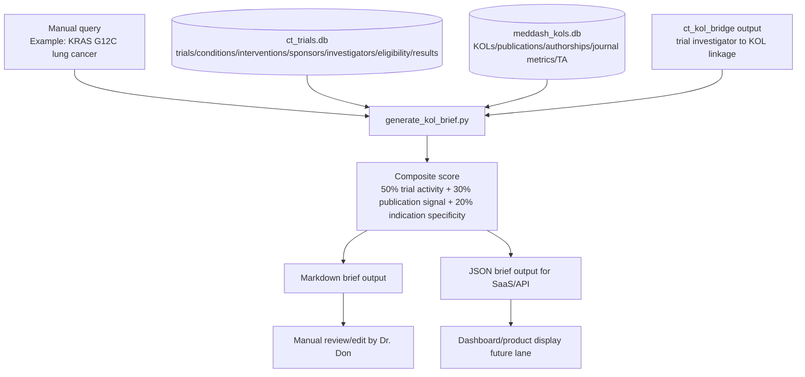

### What the generator actually uses

- CT pathway:
  - matched NCT IDs from trial conditions/title/interventions
  - investigator roles and affiliations
  - Phase 2/3 weighting
  - industry sponsorship
  - active/recruiting trial status
  - biomarker/stage/eligibility details
- KOL pathway:
  - bridged KOL ID where available
  - publication count
  - journal/SJR signal
  - therapeutic area metadata
- Output:
  - human-readable KOL intelligence brief
  - machine-readable JSON for future SaaS/API/dashboard

## E. Front-End / Dashboard Surfaces

### Current Streamlit operational cockpit

Path: `/mnt/c/Users/email/.gemini/antigravity/CTO/Meddash-CQ_Dashboard/`

Important files:

- `app.py` — Streamlit application shell
- `config.py` — central paths, Supabase env loading, SQLite paths, product paths, table config
- `supabase_client.py` — Supabase access helper
- `widgets/factory_floor.py` — factory floor/product/engine cards; CQ department narrative
- `widgets/pulse.py` — pipeline/business pulse metrics
- `widgets/pipeline_health.py` — engine health, DB/product freshness, Mermaid health map
- `widgets/meddash_panel.py` — Meddash-specific panel
- `widgets/cq_panel.py` — Clinical Quant panel and CQ-Free Newsletter branch description
- `widgets/kol_ingest.py` — KOL ingest surface
- `widgets/operations.py` — operations/costs/status surface
- `widgets/meddash_crm.py` — CRM placeholder/coming-soon lane

### Dashboard data dependencies

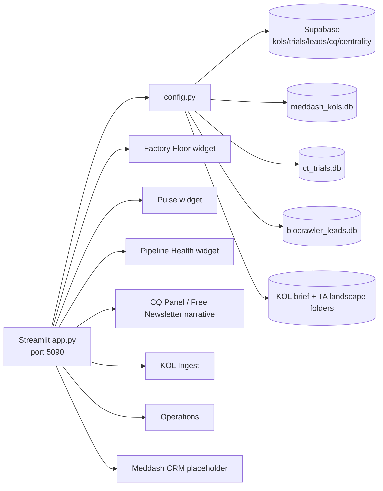

### Phase 2 UI lineage still relevant as architecture reference

The Phase 2 workflow file `CTO/MEDDASH_BACKEND_WORKFLOW/ver 2.0_organized_meddashbackend_schema.txt` maps the earlier local SaaS UI / FastAPI middleware architecture:

- Next.js 15 local SaaS UI pages:
  - Dashboard UI Page
  - Crawler Control & Execution UI
  - Campaign Sandbox Validation UI
  - Scholar Enrichment UI
  - System Health & Log Streaming UI
- FastAPI sidecar:
  - `api_server.py` REST bridge
  - subprocess manager for backend scripts
  - `/api/sandbox/*` dedup/commit endpoints
  - `/api/scholar/*` manual Scholar endpoints
- Current Phase 3 architecture keeps those learnings but operational automation is now centered on:
  - n8n as clock/router
  - Ops API as local execution bridge
  - Paperclip as worker/agent system
  - Streamlit as operational cockpit

## F. CQ Free Newsletter Path — Full Operational Blueprint

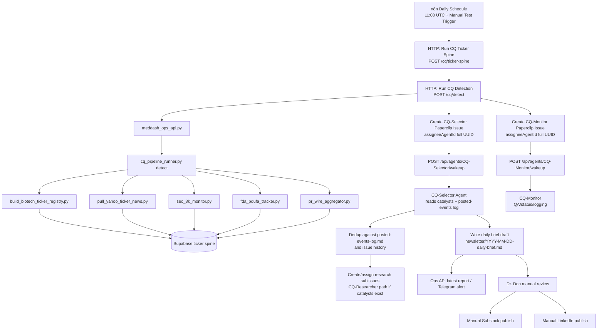

### CQ newsletter persistence and files

- Newsletter drafts:
  - `/mnt/c/Users/email/Hermes Agent Win Files/projects/clinical-quant/newsletter/`
  - example current draft: `2026-04-29-daily-brief.md`
- Dedup log:
  - `/mnt/c/Users/email/Hermes Agent Win Files/projects/clinical-quant/posted-events-log.md`
- Template:
  - `/mnt/c/Users/email/Hermes Agent Win Files/projects/clinical-quant/daily-brief-template.md`
- Design reference:
  - `/mnt/c/Users/email/Hermes Agent Win Files/projects/clinical-quant/newsletter-pipeline-design.md`

### Newsletter critical guardrails

- n8n does not write the newsletter; it only triggers Ops API and Paperclip issues.
- Paperclip agents must use `assigneeAgentId`, not short `assignee`.
- Paperclip issues must be followed by explicit agent wakeup.
- Dr. Don manually approves and publishes to Substack/LinkedIn.
- `posted-events-log.md` is append-only and must not be deleted/reset.

## G. Data Engines and Script Inventory Missing From First Master Map

### Meddash backend engines

| Engine | Directory | Main files | Role |
|---|---|---|---|
| KOL Data | `01_KOL_Data_Engine` | `nightly_scheduler.py`, `run_pipeline.py`, `extract_publications.py`, `db_ingestion.py`, `kol_disambiguator.py`, `kol_weight.py`, `review_disambiguations.py` | PubMed/XML KOL ingestion, identity resolution, weighting |
| Clinical Trials | `02_CT_Data_Engine` | `ct_crawler.py`, `ct_ingestion.py`, `ct_mesh_mapper.py`, `ct_kol_bridge.py`, `ct_results_parser.py`, `ct_pub_bridge.py`, `ct_eligibility_parser.py` | ClinicalTrials.gov JSON ingestion and normalization |
| BioCrawler GTM | `03_BioCrawler_GTM` | `biocrawler.py`, `bridge_engine.py`, `push_to_sheets.py`, `pull_from_sheets.py` | Lead/company crawl, relationship bridge, Google Sheets CRM sync |
| KOL Brief Product | `04_Product_KOL_Briefs` | `generate_kol_brief.py`, `export_kols.py` | Manual/client-ready KOL intelligence brief generation |
| TA Landscape Product | `05_Product_TA_Landscape` | `fetch_ta_landscape_data.py`, `generate_ta_landscape.py`, `generate_ta_landscape_stepwise.py`, `export_to_docx.py` | Therapeutic area landscape reports |
| Shared Datastores | `06_Shared_Datastores` | SQLite DB files | local engine state/data layer |
| DevOps/Observability | `07_DevOps_Observability` | `meddash_ops_api.py`, `meddash_pipeline_runner.py`, `pipeline_summary.py`, `telegram_notifier.py` | local execution bridge, summaries, Telegram alerts |
| MDM Ontology | `08_MDM_Ontology_Engine` | `build_disease_ontology.py` | disease/criteria standardization |
| Scholar Engine | `09_Scholar_Engine` | `sync_scholar_citations.py` | manual/API Scholar metrics enrichment |
| KOL Centrality | `10_KOL_Centrality_Engine` | `run_centrality.py`, `reliability.py` | authorship network centrality and reliability scoring |

### CQ script engines

| CQ Engine | File | Data source | Output |
|---|---|---|---|
| ticker spine schema | `market_data/create_ticker_spine_schema.sql` | migration definition | ticker/news/price/candidate tables |
| schema applier | `market_data/apply_ticker_spine_schema.py` | Supabase URI from `.env` | applied tables/columns |
| ticker registry | `market_data/build_biotech_ticker_registry.py` | Alpha Vantage listings + SEC CIK map + BioCrawler DB | `biotech_tickers`, aliases, reverse matches |
| Yahoo link ingest | `market_data/pull_yahoo_ticker_news.py` | Yahoo RSS XML | `cq_market_sentiment`, `cq_market_events` |
| SEC 8-K monitor | `phase1_regulatory/sec_8k_monitor.py` | SEC filings/API | `cq_regulatory_catalysts` |
| FDA/PDUFA tracker | `phase1_regulatory/fda_pdufa_tracker.py` | FDA/PDUFA public data | `cq_regulatory_catalysts` |
| PR Wire aggregator | `phase1_regulatory/pr_wire_aggregator.py` | RSS XML feeds | `cq_regulatory_catalysts` |
| Alpha Vantage sentiment | `phase3_sentiment/alpha_vantage_tracker.py` | Alpha Vantage API | prototype for `cq_market_sentiment` |
| Massive quant tracker | `phase4_quant/massive_tracker.py` | Massive API | prototype for `cq_price_bars` |
| CQ runner | `cq_pipeline_runner.py` | local script orchestration | output JSON to Ops API/n8n |

## H. Updated Master HTML Requirements

The corresponding HTML atlas must not rely only on the compact animated master map. It must include:

1. A dedicated data-source matrix showing every source and modality: API, XML/RSS, HTML crawl, manual, local DB, or prototype.
2. A Meddash product lane including the manual KOL brief generator and TA landscape generators.
3. A dashboard/front-end lane showing Streamlit port 5090 and the old Phase 2 Next.js/FastAPI architecture lineage.
4. A deduplication/identity-resolution lane covering KOL disambiguation, Scholar matching, ticker spine reversal, CQ posted-events log, and Paperclip issue dedup.
5. A CQ free newsletter lane ending in Obsidian draft, Telegram alert, manual Substack, and manual LinkedIn.
6. The full data-source nodes shown on the master map, not only generic “external sources.”

## I. Known Remaining Loose Ends / Future Work

- Massive price-bar ingestion is table-ready but still prototype-level.
- Alpha Vantage news sentiment is script/prototype-level; Yahoo RSS is the current bounded link metadata stage.
- Streamlit dashboard is operational but visually older; this HTML atlas is intentionally separate and richer.
- Base44 Meddash lite/search remains separate from meddash.ai and from the local Streamlit cockpit.
- Twitter/X bot is planned but not production-wired.
- n8n workflow active flags must be confirmed in UI after DB patching.

---

# Architecture Addendum — C-Run Verification and Freshness-Lane Patch

Patched: 2026-04-29 18:52:29 EDT
Reason: Section C full-run verification exposed differences between the intended architecture and the safe production execution architecture. The architecture now distinguishes full/deep manual rebuilds from bounded scheduled freshness lanes.

## J. C-Run Verification Results Now Reflected in Architecture

| Layer | Previous assumption / issue | Current architecture after fix | Verification |
|---|---|---|---|
| KOL Engine 01 | Scheduled lane ran the same as deep KOL crawl and could process `545` BioCrawler targets x `50` PubMed results plus disambiguation/weights/centrality. | Scheduled/Ops lane is bounded: `--max-targets 5 --max-results 5 --skip-disambiguation --skip-weights --skip-centrality --json-summary`. Deep rebuild remains manual/supervised. | Direct bounded run `success` in `135.19s`; live `/meddash/engine01` `success` in `122.95s`. |
| PubMed calls | Bio.Entrez calls had no explicit socket timeout. | `extract_publications.py` sets a process-wide socket timeout using `MEDDASH_PUBMED_TIMEOUT`, default `20s`. | KOL scheduled lane completed through Ops API. |
| CT health | Ops API health expected `ct_delta_summary.json`, but CT crawler writes `ct_crawler_summary.json`. | Ops API health maps logical `ct_delta` to actual file `ct_crawler_summary.json`. | Live `/meddash/health`: `ct_delta=success`. |
| SEC 8-K | SEC request path could hang CQ detection; runner allowed only `60s`. | SEC script has bounded request timeout, bounded Supabase insert timeout, and daily scan cap `CQ_SEC_MAX_TICKERS` default `40`; runner gives SEC `120s`. | `/cq/detect` rerun `success` in `106.21s`. |
| Telegram | Some scripts still emit stale internal Telegram 404s. | Ops API Telegram is authoritative; internal script Telegram should remain disabled/cleaned. | `/meddash/health`, `/cq/detect`, `/cq/latest-report` Telegram sends verified OK. |
| n8n | Workflows exist but DB active flags are `0`. | Architecture treats n8n as intended clock/router, but current verified execution lane is direct Ops API until UI activation/toggle. | C-run verified via Ops API; n8n UI activation remains operator step. |
| Dashboard | Dashboard page refresh and stale upstream data were conflated. | Streamlit app now has browser meta-refresh and last-render marker; Dashboard-Monitor is for freshness/accountability, not for updating DB. | Streamlit health/root OK; stale/partial statuses now surface visibly. |

## K. Bounded Scheduled Lane vs Deep Manual Lane

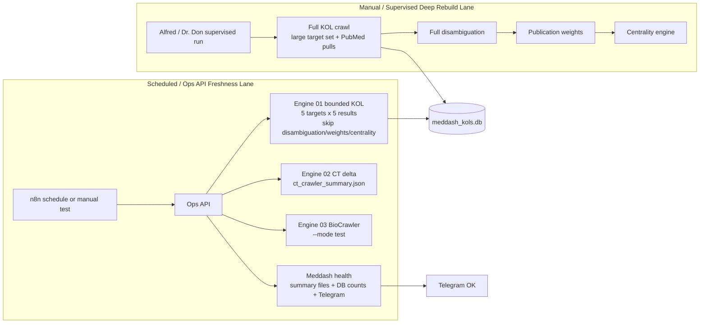

## L. Updated C-Run Green State

- Meddash Ops API `/meddash/health` verified:
  - `kol_pipeline: success`
  - `ct_delta: success`
  - `biocrawler: success`
  - Telegram OK
- CQ Ops API verified:
  - `/cq/ticker-spine`: success
  - `/cq/detect`: success after SEC timeout patch
  - `/cq/latest-report`: Telegram OK
- Paperclip verification:
  - CQ-Selector issue `THE-12` assigned by full `assigneeAgentId` and wakeup accepted HTTP `202`
  - CQ-Monitor issue `THE-13` assigned by full `assigneeAgentId` and wakeup accepted HTTP `202`
- Current remaining operator caveat:
  - n8n workflows remain `active=0` in SQLite and must be toggled active in the n8n UI for schedules to fire automatically.

## M. Files Changed by This Architecture Patch

- `01_KOL_Data_Engine/nightly_scheduler.py`
- `01_KOL_Data_Engine/run_pipeline.py`
- `01_KOL_Data_Engine/extract_publications.py`
- `07_DevOps_Observability/meddash_pipeline_runner.py`
- `07_DevOps_Observability/meddash_ops_api.py`
- `CTO/CQ_Team/scripts/phase1_regulatory/sec_8k_monitor.py`
- `CTO/CQ_Team/scripts/cq_pipeline_runner.py`
- `CTO/Meddash-CQ_Dashboard/app.py`
- `CTO/Meddash-CQ_Dashboard/widgets/pulse.py`
- `CTO/Meddash-CQ_Dashboard/widgets/pipeline_health.py`
- `CTO/Meddash-CQ_Dashboard/widgets/factory_floor.py`

## N. Updated One-Line Architecture Definition

`n8n clock/router, currently inactive until UI toggle → Ops API verified execution lane → bounded scheduled freshness engines → local SQLite/Supabase summaries → Paperclip assigned+woken agents → Ops API Telegram → Streamlit dashboard auto-refresh + Dashboard-Monitor accountability → Dr. Don manual review/publish`

