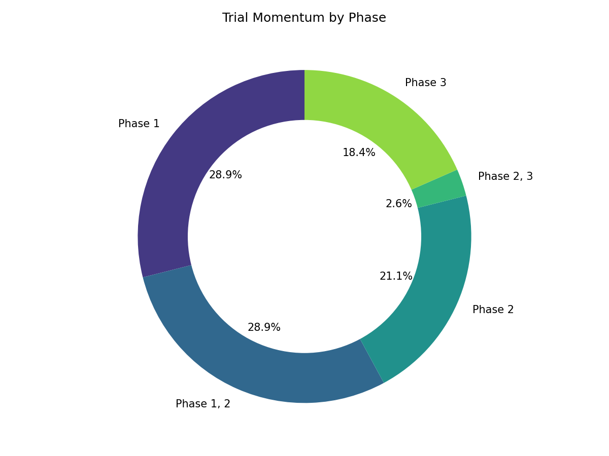
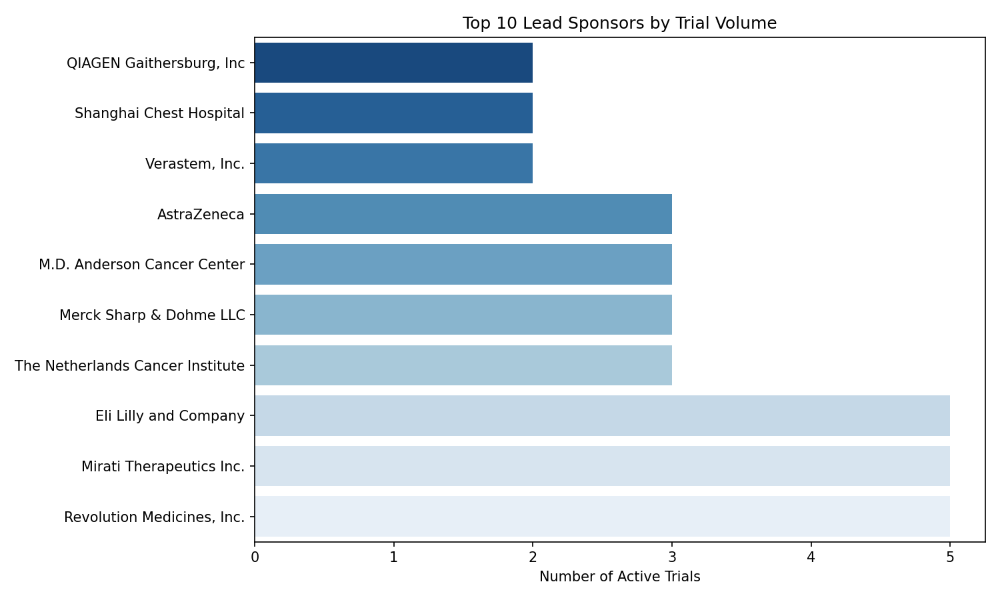

# Therapeutic Area Intelligence Landscape
**Indication:** KRAS G12C
**Generated:** 2026-03-10 23:28 UTC
**Data Sources:** ClinicalTrials.gov (API v2) & PubMed (meddash_kols.db)

---

## 1. Executive Summary
* **Total Active/Recruiting Trials:** 38
* **Total Investigators Profiled:** 53
* **Dominant Phase:** Phase 1
* **Primary Sponsor Type:** Industry (68%) vs. NIH/Academic (32%)

---

## 2. Trial Momentum & Phase Distribution
*A macro-level view of active clinical activity in this therapeutic area.*

| Phase | Active Trials | % of Total Active |
|-------|--------------|-------------------|
| Phase 1 | 11 | 28.9% |
| Phase 1, 2 | 11 | 28.9% |
| Phase 2 | 8 | 21.1% |
| Phase 2, 3 | 1 | 2.6% |
| Phase 3 | 7 | 18.4% |

---

## 3. Sponsor Landscape (Top 10)
*The most active biotech and pharma sponsors currently funding trials.*

| Rank | Sponsor Name | Active Trials | Lead Sponsor % |
|------|--------------|---------------|----------------|
| 1 | Revolution Medicines, Inc. | 5 | 100% |
| 2 | Mirati Therapeutics Inc. | 5 | 56% |
| 3 | Eli Lilly and Company | 5 | 100% |
| 4 | The Netherlands Cancer Institute | 3 | 100% |
| 5 | Merck Sharp & Dohme LLC | 3 | 75% |
| 6 | M.D. Anderson Cancer Center | 3 | 100% |
| 7 | AstraZeneca | 3 | 43% |
| 8 | Verastem, Inc. | 2 | 100% |
| 9 | Shanghai Chest Hospital | 2 | 67% |
| 10 | QIAGEN Gaithersburg, Inc | 2 | 100% |

---

## 4. Top Interventions & Modalities
*The most frequently tested investigational drugs and procedures across all trials.*

| Rank | Intervention / Drug | Trial Count | Modality Type |
|------|---------------------|-------------|---------------|
| 1 | Carboplatin | 13 | DRUG |
| 2 | Pemetrexed | 11 | DRUG |
| 3 | Pembrolizumab | 10 | DRUG |
| 4 | Cisplatin | 10 | DRUG |
| 5 | Cetuximab | 9 | DRUG |
| 6 | Docetaxel | 6 | DRUG |
| 7 | Adagrasib | 5 | DRUG |
| 8 | Trametinib | 4 | DRUG |
| 9 | Placebo | 4 | OTHER |
| 10 | AMG 510 | 4 | DRUG |

---

## 5. KOL Macro-Map (Top 20 Global Leaders)
*Investigators leading the most trials in this specific therapeutic area, enriched with their overall publication signal.*

| Rank | KOL Name | Institution | TA Trials (As PI) | Phase 3 Trials | Pub Pipeline |
|------|----------|-------------|-------------------|----------------|--------------|
| 1 | Pasi Jänne, MD | Dana-Faber Cancer Institute, USA | 1 | 1 | ⚪ Unknown |
| 2 | Gabriella Mariani, MD | AstraZeneca UK, MSD | 1 | 1 | ⚪ Unknown |
| 3 | Yilong Wu | Guangdong Provincial People's Hospital | 1 | 0 | ⚪ Unknown |
| 4 | Wade Iams, MD, MSCI | Vanderbilt University Medical Center | 1 | 0 | ⚪ Unknown |
| 5 | Timothy Yap, MD | M.D. Anderson Cancer Center | 1 | 0 | ⚪ Unknown |
| 6 | Steven A Rosenberg, M.D. | National Cancer Institute (NCI) | 1 | 0 | ⚪ Unknown |
| 7 | Shun Lu, MD, PhD | Jiaotong University,Shanghai chest Hospital | 1 | 0 | ⚪ Unknown |
| 8 | Shirish M Gadgeel | SWOG Cancer Research Network | 1 | 0 | ⚪ Unknown |
| 9 | Sarah Goldberg, MD, MPH | Yale Cancer Center, Yale University | 1 | 0 | ⚪ Unknown |
| 10 | Salman Punekar, MD | NYU Langone Health | 1 | 0 | ⚪ Unknown |
| 11 | Ryan Gentzler, MD, MS | University of Virginia | 1 | 0 | ⚪ Unknown |
| 12 | Ross Camidge, MD, PhD | University of Colorado, Denver | 1 | 0 | ⚪ Unknown |
| 13 | Rajwanth Veluswamy, MD, MSCR | Icahn School of Medicine at Mount Sinai | 1 | 0 | ⚪ Unknown |
| 14 | Martin Früh, MD | Cantonal Hospital of St. Gallen | 1 | 0 | ⚪ Unknown |
| 15 | Kathryn Arbour, MD | Memorial Sloan Kettering Cancer Center | 1 | 0 | ⚪ Unknown |
| 16 | Jarushka Naidoo | Beaumont RCSI Cancer Centre, Beaumont Hospital | 1 | 0 | ⚪ Unknown |
| 17 | Hossein Borghaei, DO | Fox Chase Cancer Center | 1 | 0 | ⚪ Unknown |
| 18 | Gregory Riely, MD, PhD | Memorial Sloan Kettering Cancer Center | 1 | 0 | ⚪ Unknown |
| 19 | Geoffrey Shapiro, MD. Ph.D | Dana-Farber Cancer Institute | 1 | 0 | ⚪ Unknown |
| 20 | Florian Guisier | Rouen - CHU | 1 | 0 | ⚪ Unknown |

---
*End of Report.*