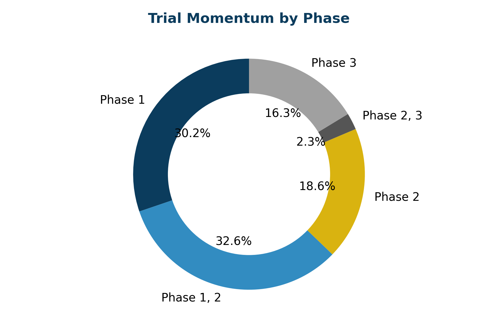
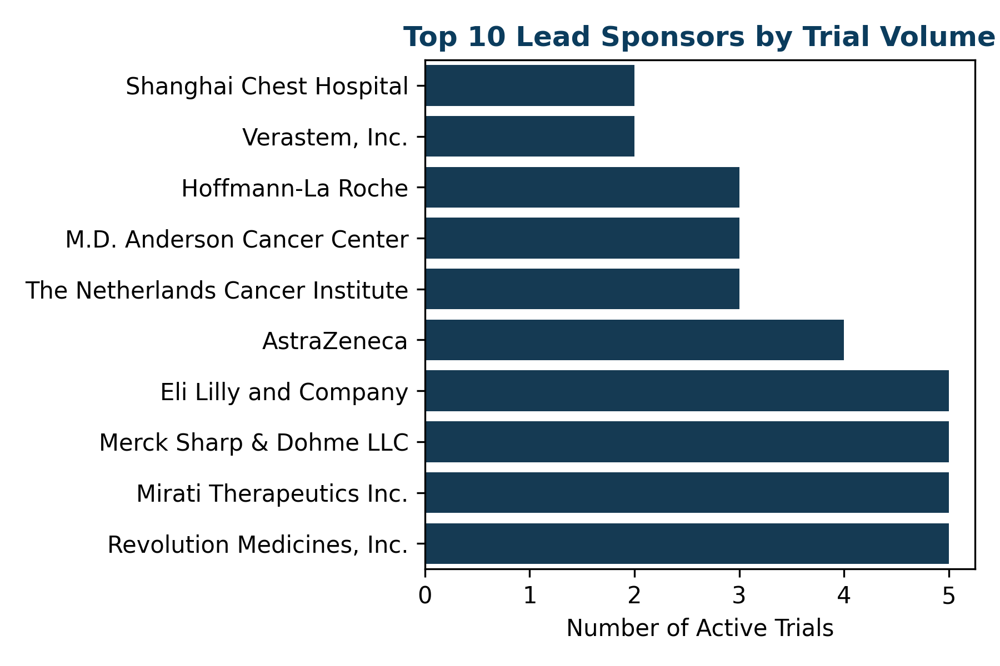
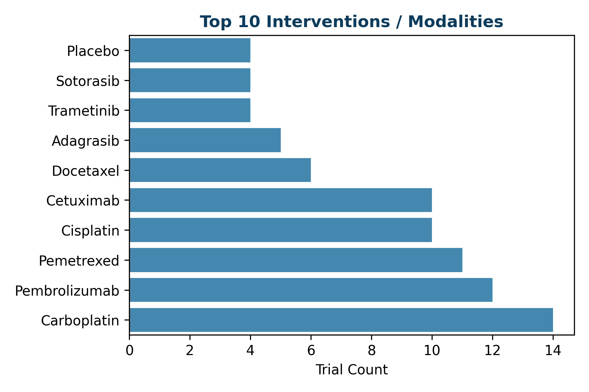

# Kras G 12
Global Clinical Development Landscape
2026-03-11
Prepared for: [Client Name]
Prepared by: Meddash Intelligence
Clinical Trial, KOL, and Competitive Landscape Analysis

---

## 1. Executive Summary
### Market Context
This report evaluates the global clinical development landscape for **Kras G 12**, capturing a macro-level footprint of current therapeutic innovation.
### Key Findings
* **Total Active Trials:** 44
* **Dominant Phase:** Phase 1, 2
* **Primary Sponsor Type:** Industry (70%) vs. NIH/Academic (30%)
### Strategic Implications
Clinical development shows robust activity. Early phase data suggests potential clinical activity across multiple novel interventions.

---

## 2. Disease Overview
*(Placeholder for expert commentary on epidemiology, pathophysiology, current standard of care, unmet needs, and disease burden charts).* 

---

## 3. Clinical Development Landscape
*Total Active/Recruiting Trials: 44*
### Phase Distribution
| Phase | Active Trials | % of Total Active |
|-------|--------------|-------------------|
| Phase 1 | 13 | 29.5% |
| Phase 1, 2 | 14 | 31.8% |
| Phase 2 | 8 | 18.2% |
| Phase 2, 3 | 1 | 2.3% |
| Phase 3 | 7 | 15.9% |

*Figure 1. Trial Momentum by Phase*

---

## 4. Geographic Trial Footprint
*(Placeholder for detailed mapping of trial site distribution at the country and city level, clinical development hubs, and recruitment geography).* 

---

## 5. Institutional Leadership
*(Placeholder for institutional leadership trial counts and focus).* 

---

## 6. Key Opinion Leader Network
*Total Investigators Profiled: 62*

| Rank | KOL Name | Institution | TA Trials (As PI) | Phase 3 Trials | Pub Pipeline |
|------|----------|-------------|-------------------|----------------|--------------|
| 1 | Pasi Jänne, MD | Dana-Faber Cancer Institute, USA | 1 | 1 | ⚪ Unknown |
| 2 | Gabriella Mariani, MD | AstraZeneca UK, MSD | 1 | 1 | ⚪ Unknown |
| 3 | Yilong Wu | Guangdong Provincial People's Hospital | 1 | 0 | ⚪ Unknown |
| 4 | Wade Iams, MD, MSCI | Vanderbilt University Medical Center | 1 | 0 | ⚪ Unknown |
| 5 | Timothy Yap, MD | M.D. Anderson Cancer Center | 1 | 0 | ⚪ Unknown |
| 6 | Taofeek Owonikoko, MD, PhD | Emory University Winship Cancer Institute | 1 | 0 | ⚪ Unknown |
| 7 | Steven A Rosenberg, M.D. | National Cancer Institute (NCI) | 1 | 0 | ⚪ Unknown |
| 8 | Shun Lu, MD, PhD | Jiaotong University,Shanghai chest Hospital | 1 | 0 | ⚪ Unknown |
| 9 | Shirish M Gadgeel | SWOG Cancer Research Network | 1 | 0 | ⚪ Unknown |
| 10 | Sarah Goldberg, MD, MPH | Yale Cancer Center, Yale University | 1 | 0 | ⚪ Unknown |
| 11 | Salman Punekar, MD | NYU Langone Health | 1 | 0 | ⚪ Unknown |
| 12 | Ryan Gentzler, MD, MS | University of Virginia | 1 | 0 | ⚪ Unknown |
| 13 | Ross Camidge, MD, PhD | University of Colorado, Denver | 1 | 0 | ⚪ Unknown |
| 14 | Rajwanth Veluswamy, MD, MSCR | Icahn School of Medicine at Mount Sinai | 1 | 0 | ⚪ Unknown |
| 15 | Martin Früh, MD | Cantonal Hospital of St. Gallen | 1 | 0 | ⚪ Unknown |
| 16 | Kathryn Arbour, MD | Memorial Sloan Kettering Cancer Center | 1 | 0 | ⚪ Unknown |
| 17 | Jarushka Naidoo | Beaumont RCSI Cancer Centre, Beaumont Hospital | 1 | 0 | ⚪ Unknown |
| 18 | Hossein Borghaei, DO | Fox Chase Cancer Center | 1 | 0 | ⚪ Unknown |
| 19 | Gregory Riely, MD, PhD | Memorial Sloan Kettering Cancer Center | 1 | 0 | ⚪ Unknown |
| 20 | Geoffrey Shapiro, MD. Ph.D | Dana-Farber Cancer Institute | 1 | 0 | ⚪ Unknown |

---

## 7. Sponsor Landscape
| Rank | Sponsor Name | Active Trials | Lead Sponsor % |
|------|--------------|---------------|----------------|
| 1 | Revolution Medicines, Inc. | 5 | 100% |
| 2 | Mirati Therapeutics Inc. | 5 | 56% |
| 3 | Merck Sharp & Dohme LLC | 5 | 71% |
| 4 | Eli Lilly and Company | 5 | 100% |
| 5 | AstraZeneca | 4 | 50% |
| 6 | The Netherlands Cancer Institute | 3 | 100% |
| 7 | M.D. Anderson Cancer Center | 3 | 100% |
| 8 | Hoffmann-La Roche | 3 | 100% |
| 9 | Verastem, Inc. | 2 | 100% |
| 10 | Shanghai Chest Hospital | 2 | 67% |

*Figure 2. Sponsor Landscape*

---

## 8. Mechanism and Modality Trends
| Rank | Intervention / Drug | Trial Count | Modality Type |
|------|---------------------|-------------|---------------|
| 1 | Carboplatin | 14 | DRUG |
| 2 | Pembrolizumab | 12 | DRUG |
| 3 | Pemetrexed | 11 | DRUG |
| 4 | Cisplatin | 10 | DRUG |
| 5 | Cetuximab | 10 | DRUG |
| 6 | Docetaxel | 6 | DRUG |
| 7 | Adagrasib | 5 | DRUG |
| 8 | Trametinib | 4 | DRUG |
| 9 | Sotorasib | 4 | DRUG |
| 10 | Placebo | 4 | OTHER |

*Figure 3. Top Interventions*

---

## 9. Strategic Signals
*(Placeholder for high-value interpretation and strategic signals).* 

---

## 10. Methodology & Appendix
**Data Sources:** ClinicalTrials.gov (API v2), PubMed, Scimago Journal Rank.
**Pipeline Explanation:** Trials identified via MeSH expansion. Investigator identity resolved via probabilistic matching. Publication impact weighted via SJR.