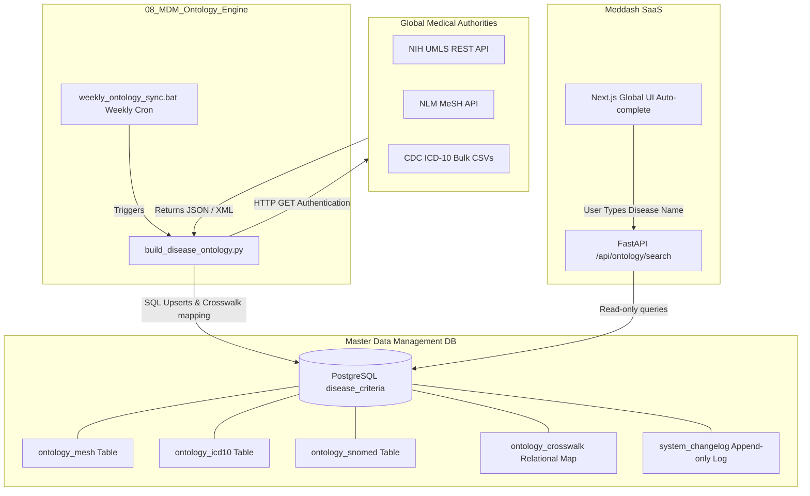

# 08_MDM_Ontology_Engine 
## Master Data Management: Universal Disease Criteria Database

### Objective
This directory houses the engine responsible for securely building and maintaining a unified PostgreSQL database (`disease_criteria`). It creates a Master Data Management (MDM) layer that maps **MeSH, ICD-10, and SNOMED CT** ontologies together. This centralizes medical classifications, preventing the KOL, Clinical Trials, and BioCrawler databases from relying on hardcoded, disjointed medical string arrays.

### Schema Blueprint

### Technical Execution Sequence

#### 1. Database Provisioning & Schema
- Create the `disease_criteria` PostgreSQL schema in Supabase.
- Build the core tables via python ORM/SQL:
    - `ontology_mesh` (ID, Term, Tree_Numbers)
    - `ontology_icd10` (Code, Description, Chapter)
    - `ontology_snomed` (Concept_ID, Fully_Specified_Name)
    - `ontology_crosswalk` (Mapping IDs between the three autonomous systems)
    - `system_changelog` (Tracks version updates, API payload states, and timestamps automatically).

#### 2. Python Ingestion Engine (`build_disease_ontology.py`)
- Connect securely to the NIH UMLS REST API and native CMS databases.
- Build the core upsert logic to dynamically populate the PostgreSQL tables and write natively to the `system_changelog` on every execution loop.
- Establish `weekly_ontology_sync.bat` to ensure the core dataset is surgically accurate against CDC updates.

#### 3. Application Integration & Next.js UI
- Wire `api_server.py` to expose `/api/ontology/search?query=...` for lightning-fast typeahead UI functionality.
- Upgrade `src/app/control/page.tsx`:
    - Bind the Disease Name, MeSH, ICD-10, and SNOMED inputs to React `onChange` listeners.
    - When the user types, fire a background request to the FastAPI bridge to populate a secure dropdown suggestion box (Autocomplete) from the `disease_criteria` DB.
